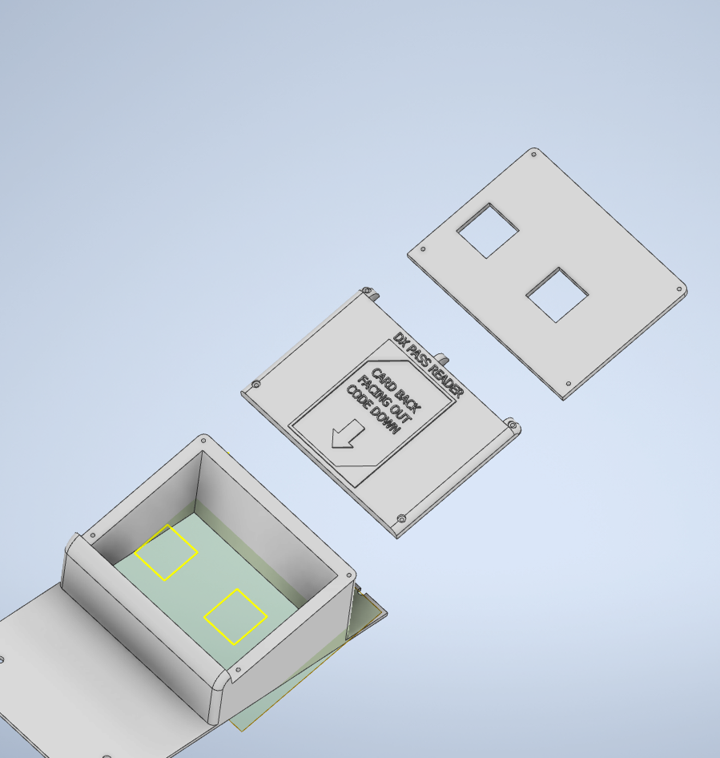

# 🖨️ SpiralGlide's resources

The original inspiration for this guide comes from the work of **SpiralGlide**, a community member who documented their own *FiNALE → DX* conversion and designed several 3D-printable parts for the job. This page gathers those original resources.

## The original conversion notes

* **[DxNALE conversion notes (PDF)](../resources/pdfs/dxnale-original-guide.pdf)**: the original reference document written by SpiralGlide, which this guide was built on.

## The 3D-printable parts

SpiralGlide modelled the mounts that let the Aime reader and the DX QR-code reader be fitted to the cabinet's center tower without any destructive modification. That is four `.stl` files, split into two assemblies.

### Aime reader mount

A single printed block: the Star Horse 4 Aime reader mounts onto it, and it takes its place in the front of the center tower, using the screw holes meant to hold the acrylic.

* **[maimai-aime-reader.stl](../resources/models/spiralglide/maimai-aime-reader.stl)**: Aime reader mount.
* **[maimai-aime-reader.ipt](../resources/models/spiralglide/maimai-aime-reader.ipt)**: the mount's original Autodesk Inventor source file, provided by SpiralGlide, for anyone who wants to modify it.

!!! lightbox
    

### QR-code reader mount (DX Pass Reader)

Three parts that stack together: the box that sits in the center tower, the middle plate that positions the camera (card back facing out, code down), and the front panel with its two openings.

* **[dxnale-dx-pass-reader.stl](../resources/models/spiralglide/dxnale-dx-pass-reader.stl)**: main box.
* **[dxnale-dx-pass-reader-midpanel-v2.stl](../resources/models/spiralglide/dxnale-dx-pass-reader-midpanel-v2.stl)**: middle plate.
* **[dxnale-dx-pass-reader-front-panel-v2.stl](../resources/models/spiralglide/dxnale-dx-pass-reader-front-panel-v2.stl)**: front panel.

!!! lightbox
    

---
