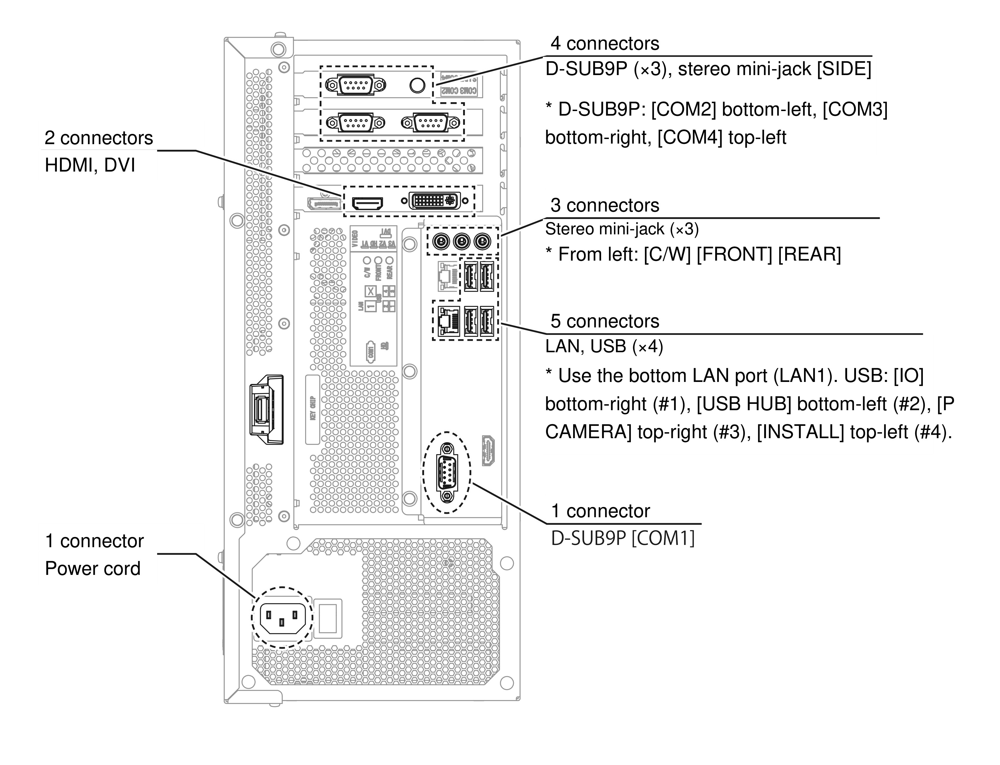
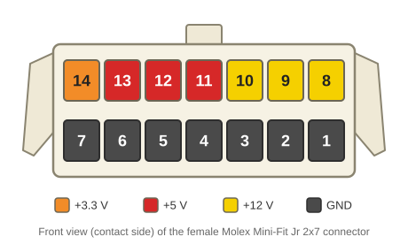

# 🛠️ Step 1: Replacing the Central PC (ALLS)

## Technical background

??? note "Click here for the technical explanation"
    The old *RingEdge 2* PC cannot run *DX*: you need an **ALLS HX2** PC.  
    Beyond the newer, more powerful hardware, the operating system is radically different between the two machines. **The replacement is mandatory.**
    
    An **ALLS MX2** also works: its specifications exceed the minimum required for *DX*. In principle, **every second-generation ALLS** (those whose model name ends in 2) **is software-compatible**, but some lack the power to run the game properly. That is the case, for example, of the **ALLS X2**: compatible, but too weak for a pleasant experience. These models can be upgraded, but the job quickly gets complicated: *you are better off getting a suitable model from the start.*

    An ALLS is very similar to a modern gaming PC, with two particularities:

    - **A recessed USB port** on top of the motherboard, reserved for the **keychip**. This USB key identifies the cabinet's owner on the official Sega network and decrypts the game data.
    - **Two expansion cards** (on second-generation models), which add three RS-232 serial ports and a 2.5mm audio jack. Together with the motherboard's COM port, these serial ports connect the Aime reader, the VFD and the touch panels of both screens. The jack is dedicated to one of the two headphone outputs.

    !!! tip "The ALLS power supply"
        The ALLS power supply switches voltage automatically: its C13 connector accepts 100V, 110V, 220V or 240V alike. **No external transformer is needed.**

    !!! warning "Storage"
        An official *DX* ALLS HX2 contains **two drives**: a 120GB SSD and a 500GB hard drive (named "SUB STORAGE"). **The game needs both**, the SSD alone is not enough. If your ALLS has only one drive, you will need to install a second one.

        To do so, see the [ALLS HX2 Service Manual](../resources/pdfs/alls-hx2-service-manual-full.pdf): **plugging in the drive is not enough**, a software step detailed in the manual is also required.

## Installing it in the cabinet

### Removing the RingEdge 2 and clearing the PC compartment

Start by **unplugging every connector from the RingEdge 2** and take it out of the cabinet. It will no longer be used: only keep it if you plan to convert the cabinet back to FiNALE someday.

!!! tip "Take out the whole board"
    Depending on your cabinet model, the RingEdge 2 is probably mounted on a wooden board. If so, remove the board directly rather than fighting with the hard-to-reach screws holding the PC in place.

Most of the surrounding components can be removed as well. To the right of the RingEdge 2, you will find **three PCBs**:

- **The IO3**, at the very top, recognizable by the large ribbon cable connected to it.
    * **Remove it**, along with its USB cable: it is replaced by the IO4 on *DX*.
- **The RS-232 to USB adapter**, bottom left, connected to the RingEdge 2 over USB. Two two-wire connectors are normally plugged into its bottom row.
    * **Keep it**: this board links the LED controllers to the PC. Take the opportunity to remove it and dust it off, you will reinstall it later.
- **The FiNALE touch panel controller**, bottom right, connected to the RingEdge 2 by a three-wire cable ending in a DB9.
    * **Remove it**, along with its cable and the two white cables connected underneath: the *DX* touch panels are radically different and no longer use this component.

Once these three PCBs are out, tidy up: **you will need all the available space.** If the RingEdge 2 was mounted on a board, you should now have a perfectly flat surface. *If it sat on two wooden slats, remove them too.* Where possible, secure the cables along the side walls rather than on the floor, to free up as much room as possible.

**The FiNALE router and camera** can be removed too: the router was notably used to link the camera to the RingEdge 2, and that camera is no longer used on *DX*. Also remember to remove the 2.5mm audio jack cable that linked the camera to the RingEdge 2.

#### Video cables

Originally, pre-*DX* maimai cabinets connect their screens to the RingEdge 2 with **two DVI to VGA cables** (VGA end on the screen). A choice that remains a mystery, since both screens have a DVI input: many operators therefore replaced them with plain DVI to DVI cables. Depending on your cabinet's history, you will find one or the other:

- **Player 1**: remove the cable, whatever it is.
- **Player 2**: **keep it if it is a DVI to DVI cable**, remove it if it is the original DVI to VGA.

!!! success "What should remain"
    Of the original RingEdge 2 wiring, you should only have left:

    - the two 2.5mm audio jack cables for the player 1 and player 2 speakers
    - the Molex Mini-Fit Jr cable (power)
    - possibly, the DVI to DVI cable for the player 2 screen

### Installing the ALLS

The ALLS is wider than the RingEdge 2, but the space you just cleared lets you install it comfortably, along with the various PCBs we will connect to it later. On official *DX* cabinets, the ALLS is actually installed *vertically*: that is an option if you are short on space. **What matters is that the PC is firmly secured** and cannot move if the cabinet is moved.

Once the ALLS is in place, you can already:

- **Mount the IO4**, ideally where the old IO3 was, to take advantage of the nearby original power cables. If you opted for the [conversion PCB]({{IO4_CONVERSION_PCB}}), plan room for it as well.
- **Reinstall the RS-232 to USB adapter.**
- **Plug the USB hub into the ALLS's USB 2 port**, then the RS-232 to USB adapter into that hub.
- **Install your new 5V/12V switching power supply** (see [Power supply](#power-supply)). Ideally, place it on the player 1 side with the other switching power supplies, even if that requires longer cables.

The remaining cables will be reconnected over the following steps.

## Connections

Here is the plate from the [official maimai DX manual](../resources/pdfs/maimai-dx-instruction-manual-full.pdf) (page 128) detailing all the connectors on an ALLS HX2. Let's go through each connection in detail.

!!! lightbox wide
    

Most of the devices to connect are covered in more detail in the following steps: if in doubt about a connection, finish the corresponding chapter first, then come back to this page. **According to the official *DX* manual, the order of the USB ports matters**: stick to the assignment below.

### Internal PSU

- **C13 connector**: Mains connection, accepts any input voltage from 100V to 240V.

### Keychip

- **USB port**: Reserved for the keychip. It can **not** be used as a regular USB port.

### Motherboard

- **COM1 - DB9 port**: Aime reader
- **LAN1 - RJ45 port**: Network port, to be connected to the service router. The second network port is unused.
- **2.5mm audio jacks**:
    - **C/W**: Player 1 headphones
    - **FRONT**: Player 1 speakers
    - **REAR**: Player 2 speakers
- **USB**:
    - **USB 1**: SEGA IO4
    - **USB 2**: USB hub, to which the two QR code cameras and the `4x RS-232 to USB` adapter are connected.
    - **USB 3**: Player camera
    - **USB 4**: Installation port, for a USB stick containing the game data to install.

### Graphics card

- **HDMI**: Connected to the player 1 screen via an HDMI - DVI-D cable.
- **DVI**: Connected to the player 2 screen via a DVI-D cable.
- **DisplayPort**: Unused, mirrors the player 1 video signal.

### Expansion cards

- **COM2 - DB9 port**: VFD
- **COM3 - DB9 port**: Player 1 touch panel
- **COM4 - DB9 port**: Player 2 touch panel
- **SIDE**: Player 2 headphones

## Power supply

Most connections are fairly straightforward, but **one essential RingEdge 2 connector has no equivalent on the ALLS**: the one that powers the external peripherals.

On the RingEdge 2, next to the keychip port, comes out a **female 2x7-pin Molex Mini-Fit Jr connector**. It links several parts of the cabinet, including the IO3, to the PC's internal power supply. Rather than rewiring the whole area, **the simplest solution is to build a small adapter** from an identical Molex Mini-Fit Jr connector, wired to a **switching power supply providing 5V and 12V** (typically an enclosed model with screw terminals, like those from the Mean Well brand). The original connector also provides 3.3V, but no hardware in this area uses it.

!!! warning "Do not reuse the cabinet's power supplies"
    Among other things, this harness will power the IO4. Reusing the existing 5V supply would have little consequence, but **reusing the LEDs' 12V supply would be a mistake**: to avoid any backfeed current, the IO4 and the LEDs must each have their own power supply, as the IO4 is not designed to handle that much current.

!!! warning "Tie the grounds together"
    **Connect the GND of your new power supply to the GND of one already in place in the cabinet.** A floating power supply can cause all sorts of unexpected problems.

Wire the female connector following the diagram above. It is shown **from the front, contact side**: do not confuse it with the wire side.

- Pin 14: **3.3V** (optional, unused)
- Pins 13-11: **5V**
- Pins 10-8: **12V**
- Pins 7-1: **GND**

Connect each wire to the matching terminal of your power supply. Little current flows through this harness (less than 3A in total, all voltages combined), but **make sure to use a suitable wire gauge**: **20 AWG** (0.5mm²) is ideal. The 22 AWG wire from the [equipment list](equipment.md) also works, since each voltage is spread over several pins. Just check that your Mini-Fit Jr crimp terminals accept the gauge you choose (18-24 AWG terminals are the most common).

All that's left is to plug your homemade connector into the original cable.

!!! warning "The power supply must be firmly secured"
    The cabinet moves around a lot: **the power supply must never be able to shift or tip over.** Screw it firmly to the floor of the compartment.

## Summary
!!! tldr "The big picture"
    For the ALLS and the power supply:

    * Remove the RingEdge 2 and clear the compartment (IO3, FiNALE touch controller, router, camera)
    * Install the ALLS HX2 in its place and secure it firmly
    * Connect the various peripherals to the ALLS (see the following steps)
    * Build an adapter cable for the external power connector
    * Install the external power supply and the adapter cable in the cabinet, then plug in the existing connector

---

Let's move on to [Step 2: HDX Display and Touchscreens](step-2-touchscreen-display.md).
