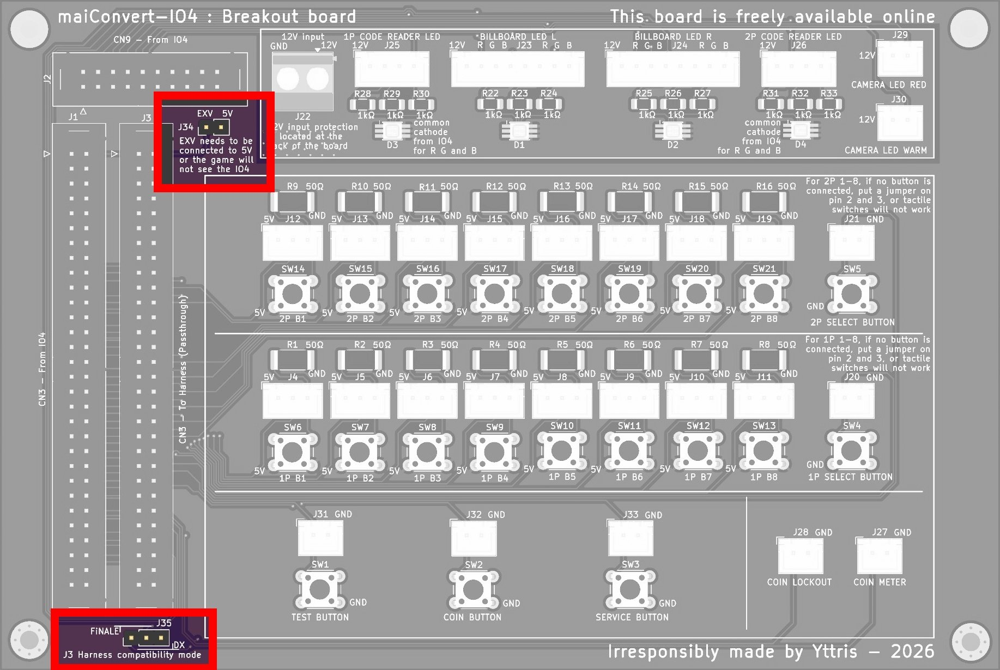
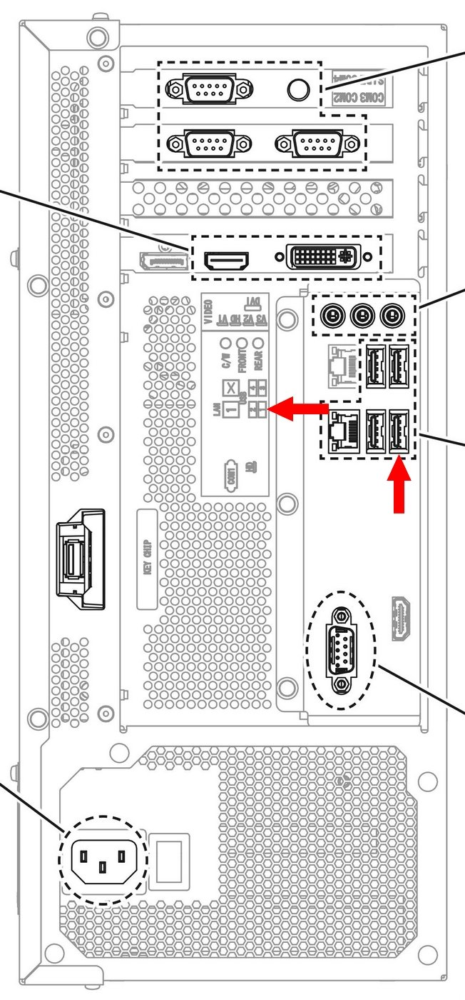

# 🕹️ Step 3: The I/O Board and the Buttons

To run *DX*, **the FiNALE IO3 must be replaced with a newer IO4**. Button-wise, the two models differ very little, but the wiring still needs to be adapted.

## Technical explanation

??? note "Click here for the technical explanation"
    The move to the IO4 brings two major changes to the DX cabinet wiring compared to FiNALE:

    * **The wiring harness was modified**: it now includes the two 1P SELECT and 2P SELECT buttons, and the Coin Locker moves from pin 51 to pin 53.
    * **The IO4 now handles the lighting** of several parts of the cabinet.

    The first point is simple, the second far more restrictive: **6 LED signals now go through the IO4**, where the LED controllers used to handle the lighting on their own on FiNALE.

    Another change: **the IO4 talks to the PC over USB**, no longer over JVS as on RingEdge 2. *Some IO4 variants also support JVS, but that doesn't matter here: the connection is always made over USB.*

    !!! lightbox
        

    *(Note: the full wiring detail for the IO4 is on page 194 of the [manual](../resources/pdfs/maimai-dx-instruction-manual-full.pdf), or directly [here](../resources/images/wiring-diagrams/maimai-dx-wiring-diagram-2-of-4.jpg), from **[E-2]** to **[F-6]**.)*

    !!! info "Powering the IO4"
        The USB connection is not enough to power the IO4. It also needs:

        * a **5V** source, through connector **CN7**, **CN8** or both,
        * a **12V** source, through connector **CN1**, **CN2** or both.

        Good news: **the IO3 power connectors plug into the IO4 as they are**. They are already connected to the external power supply installed in [step 1](step-1-alls-and-psu.md).

## Installing the IO4

Start by **plugging the original IO3 power connectors into the IO4, mounted in [step 1](step-1-alls-and-psu.md)**: **CN1**/**CN2** for 12V, **CN7**/**CN8** for 5V.

To install the IO4 in a FiNALE cabinet, you have two options:

* **Modify the harness by hand.**
* **Use the conversion PCB.**

**The second option is by far the easiest**:

* **No harness modification**: it plugs into the PCB as is, and the PCB takes care of the rest.
* **Ready-to-use connectors** for the new signals the cabinet lacks, such as the 1P SELECT and 2P SELECT buttons.
* **Free**: the files are [on GitHub]({{IO4_CONVERSION_PCB}}), with a short guide to have it manufactured yourself.

Either way, *the LEDs are covered in detail in [step 6](step-6-lighting.md)*: this chapter focuses on the harness.

??? example "The easy way - The conversion PCB"

    ### The conversion PCB

    The conversion PCB makes things much simpler, **especially for the LEDs** in [step 6](step-6-lighting.md). It has two connectors in the same format as CN3: **one plugs into the IO4, the other takes the cabinet harness.**

    !!! lightbox
        

    #### Installing the PCB

    The PCB goes right next to the IO4. **Four connections are all it takes:**

    1. PCB **J1** → IO4 **CN3**.
    2. PCB **J2** → IO4 **CN9**.
    3. **12V** on the PCB's **J22** connector (see below).
    4. **Cabinet harness** → PCB **J3**.

    !!! tip "Which ribbon cables to use"
        The IO4's original connector is a JST-RA, but **any connector with a 2.54 mm pitch will do**. The easiest option: **IDC ribbon cables with a female connector on each end**. You need two: a **2x30** for CN3 and a **2x10** for CN9.

    #### Powering the PCB

    The PCB needs **clean 12V on the J22 connector**: it lights up the LEDs now driven by the IO4. **Ideally, use the cabinet's LED power supply.**

    A lot of current will flow through this circuit: **use a wire gauge that is large enough**, ideally **1.5 mm²**. *Better too much than not enough.*

    !!! warning "Polarity"
        **Double-check your wiring.** If 12V and GND are swapped, the PCB protects itself: your cabinet is not at risk, *but the PCB fuse blows* and will have to be replaced before the board works again.

    !!! danger "Don't use the IO4's power supply"
        The IO4 and the LEDs must **each have their own power supply**. So don't reuse the switching power supply installed in [step 1](step-1-alls-and-psu.md) for the PCB, for two reasons:

        * **Not enough power**: unless it is a high-end model, a small switching power supply won't handle the load of all the LEDs. It will run hotter than it should, which is dangerous. The cabinet's power supply, on the other hand, is designed for exactly that.
        * **Backfeed current**: the IO4's 12V rail is not designed for such a load. Using it for the PCB would eventually damage the IO4.

    #### Setting the jumpers

    The PCB has two jumper locations:

    * **J34 - EXV jumper**: ties the `EXV` signal to 5V. *Normally the cabinet harness already does this*, but you can install it if that isn't the case.
    * **J35 - Harness type**: tells the PCB whether the connected harness comes from FiNALE or DX.
        * **Unmodified FiNALE harness** (the case in this guide): jumper on the **two left pins**.
        * **Harness already modified by hand**, or a real DX cabinet: jumper on the **two right pins**.

    !!! lightbox
        

    #### Connecting the Select buttons

    The PCB provides **two male 2-pin JST-XH connectors** for the 1P SELECT and 2P SELECT buttons: crimp a **female 2-pin JST-XH** on the button side, plug it in, and you're done. [SpiralGlide's Aime reader mount](spiralglide-resources.md#aime-reader-mount), installed in [step 4](step-4-aime-reader.md), has a spot reserved for them.

    *No other button needs to be connected to the PCB*: **all the others go through the cabinet harness.**

??? example "Modifying the harness by hand"

    ### Modifying the harness by hand

    To modify the harness by hand, there are four points to handle.

    #### The coin blocker (Coin Locker)

    Its pin changed: **wired to pin 51 on *FiNALE*, it moves to pin 53**.

    1. On the large harness formerly plugged into connector **CN3** of the IO3, locate pin **51**.
    2. Move that wire to pin **53**.

    #### Adding the "Select" buttons

    *DX* adds **two buttons to sort songs**, which you wire yourself:

    1. **Install the buttons** on the central panel. [SpiralGlide's Aime reader mount](spiralglide-resources.md#aime-reader-mount), installed in [step 4](step-4-aime-reader.md), has a spot reserved for them.
    2. **Connect one pin of each button to ground (GND)** on the **CN3** connector harness (pins 9 to 16).
    3. **Connect the other pin** to the matching pin of connector **CN3**:
        * "1P SELECT BUTTON": pin **27**
        * "2P SELECT BUTTON": pin **26**

    #### Preparing the billboard LEDs

    Lighting is covered in [step 6](step-6-lighting.md), but **since you are already working on CN3, prepare the two red billboard signals now**:

    1. Crimp a wire on pins **51** (`BILLBOARD LED L RED`) and **52** (`BILLBOARD LED R RED`) of **CN3**. *Pin 51 is precisely the one freed up by the Coin Locker.*
    2. Terminate them with a **female 2-pin JST-SM**, which will be connected to the billboard harness in step 6. *Since this side carries current, a female connector prevents any accidental contact.*

    ??? info "For reference: all the LEDs handled by the IO4"
        * "BILLBOARD LED L RED": connector **CN3** - pin **51**
        * "BILLBOARD LED R RED": connector **CN3** - pin **52**
        * "BILLBOARD LED L GREEN": connector **CN9** - pin **5**
        * "BILLBOARD LED R GREEN": connector **CN9** - pin **6**
        * "BILLBOARD LED L BLUE": connector **CN9** - pin **9**
        * "BILLBOARD LED R BLUE": connector **CN9** - pin **10**
        * "CAMERA LED WARM": connector **CN9** - pin **7**
        * "CAMERA LED RED": connector **CN9** - pin **8**
        * "1P CODE READER LED": connector **CN3** - pin **55**
        * "2P CODE READER LED": connector **CN3** - pin **56**

    #### Checking the EXV jumper

    Normally already done, but check that pins **1-2** of **CN3** are connected to pins **3-4**. This jumper ties the `EXV` signal to 5V: **without it, the game won't detect the IO4.**

## USB connection

All that's left is to **plug the IO4 into the ALLS USB 1 port**, as explained in [step 1](step-1-alls-and-psu.md).

!!! lightbox
    

## In summary
!!! tldr "The big picture"
    For the I/O board:

    * Plug the original power connectors into the IO4.
    * Install the 1P SELECT and 2P SELECT buttons on the central panel.

    If you choose the conversion PCB:

    * Connect the PCB to the IO4's CN3 and CN9 connectors with IDC ribbon cables, then plug the cabinet harness into it.
    * Power the PCB with 12V from the cabinet's LED power supply, using 1.5 mm² wire.
    * Set jumper J35 to the FiNALE position (two left pins).
    * Plug the Select buttons into their JST-XH connectors.

    If you choose manual wiring:

    * Move the Coin Locker wire from pin 51 to pin 53 of CN3.
    * Wire the Select buttons to pins 26 and 27 of CN3.
    * Prepare a female 2-pin JST-SM connector for the red billboard LEDs.
    * Check the EXV jumper.

    Finally:

    * Plug the IO4 into the ALLS USB 1 port.

---

Let's move on to [Step 4: The Aime Card Reader](step-4-aime-reader.md).
