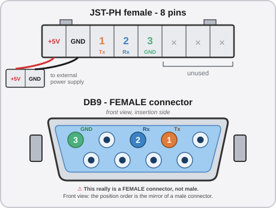
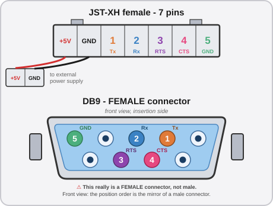

# 💳 Step 4: The Aime Reader and the VFD

The FiNALE Aime readers are not compatible with DX. You need to install a new version. On top of that, although it has no real use for our conversion, the VFD is also a necessary addition. Fortunately, they are very simple to install.

## Technical explanation

??? note "Click here for the technical explanation"
    FiNALE uses a system based on two previous-generation Aime readers, chained to each other. The top reader reads the card for the left player, and the bottom one for the right player. On DX, there is only a single reader, and when a card is scanned, the profile appears on both screens. The owner of the profile can then simply confirm the login on their screen; the second player is then free to scan their own card. The technology used is also completely different. It is impossible to reuse a FiNALE Aime reader.

    !!! info "aic_pico"
        It is technically possible to use an [aic_pico](https://github.com/whowechina/aic_pico), an open-source project that reproduces the behavior of a real Aime reader transparently for the game. These are much cheaper to produce than getting a real Aime reader, but would need a good deal of tinkering to be connected to the corresponding DB9 port on the ALLS.

    In any case, last-generation Aime readers are not that rare, and often come as a combo with the VFD that we also need. The particularity of this last generation is that it is technically compatible with electronic payment; however, even in Japan, that feature is almost never used. Operators typically prefer to install their own payment terminal on the cabinet, which is more flexible and offers more payment options.

## The connectors

The connection to the ALLS itself is extremely simple:

* Aime reader: **COM1**
* VFD: **COM2**

Both COM ports are physical DB9 ports on the ALLS motherboard. However, your Aime + VFD combo probably did not arrive with a DB9 cable you can simply plug in. **We are going to have to crimp our own cables**, which will interface with the connectors of the Aime reader and the VFD.

!!! lightbox
    
    

Take your female-female DB9 cable, and **cut it in two at the middle of the cable** to expose the wires. You have two options:

* Either you take a cable that, once cut in two, is long enough to run cleanly the whole distance from the ALLS to the center of the cabinet, where the Aime reader + VFD will be installed.
* Or you prefer to cut the cable at about twenty centimeters to expose a floating female DB9 connector that you can then connect to the ALLS via a simple male-female DB9 cable of an appropriate length.

The second option is more practical to handle, avoids having to manage an unreasonable length of cable while crimping the connector, and also makes installation easier. On top of that, it will make the combo easier to unplug if you ever need to take it apart for maintenance.

!!! lightbox
    

### Making the cable for the Aime reader

The Aime reader is the simpler of the two: it only needs 5 wires, even though the connector has 8 pins.

Every DB9 cable is different; yours probably won't have the same wire colors as another. From there, the simplest way to be sure you don't make a mistake is to use a multimeter in continuity mode.

* Put the tip of your multimeter into the hole of the female DB9 socket corresponding to the pin you want to wire. *(See diagram above)*
    * If the tip of your multimeter is too wide to fit, use a male Dupont wire connected to the probe tip.
* With the second tip, touch the wires one by one until you hear the beep. **The wire that beeps is the one that corresponds to your pin.** Mark it.
* After marking all the useful wires *(3 for the Aime reader, 5 for the VFD)*, cut all the others.
* Crimp the remaining wires with **female JST-PH** pins, then insert them into your 8-pin female JST-PH connector.

Once this is done, you are almost finished. You still need to crimp two extra wires with two **male JST-PH** pins, ideally a red wire that you will connect to the 5V pin of the connector, and a black wire that you will connect to the GND pin right next to it. The final connector should have a total of 5 wires, of which 3 are connected to the DB9 socket and 2 are "floating" and will later be connected to the power supply.

{ width="80%" }

!!! warning "Watch out for the GNDs"
    You may have noticed that two of the pins you have to crimp are GND, the common ground. Since, as the name says, the common ground is common, you might consider crimping only one of them. That would work, but go with both: one to go alongside the 5V and cover the reader's power, and the other to be connected to the DB9 port according to the RS-232 communication standard.

### Making the cable for the VFD

The VFD has a 7-pin connector and all of them must be crimped for it to work.

The operation is therefore almost exactly the same as for the Aime reader's JST-PH, except that the VFD's connector is a JST-**X**H. Also, for the VFD you will additionally need to connect the `CTS` signal and the `RTS` signal wires to the serial port.

{ width="80%" }

Once this step is finished, congratulations, you have made your own cables for the connection to the ALLS.

!!! lightbox
    

!!! tip "Crimp one connector for the power wires"
    On both the Aime reader's connector and the VFD's, we installed two extra wires for the 5V power and the GND. For a simpler installation, take the two pairs of wires, crimp the two 5V together and the two GND together in a Y onto a single JST-SM connector next to your two DB9 cables. It will then be simpler to install the hardware on the cabinet and to unplug it if needed for maintenance.

### Secure the cables

Plug the two cables you have just made into the corresponding ports. Then secure them at the back of the Aime reader + VFD combo to make sure they are not under any strain. Even with the best crimping technique in the world, our connectors will remain fragile. Once the connectors are plugged in and secured, all that is left is to install the combo on the cabinet.

!!! lightbox
    

## Installation on the cabinet

You can use [the 3D model designed by SpiralGlide](spiralglide-resources.md#aime-reader-mount), which mounts on the cabinet using the existing screws for the acrylic glass. It was designed specifically for the Star Horse 4 Aime reader, and fits onto the cabinet non-destructively by reusing the existing holes for Aime readers. It also includes a slot for the 1P SELECT and 2P SELECT buttons so they can be easily fitted.

!!! lightbox
    

## Final step

Now that the combo is installed on the front of the cabinet, all that is left is to connect the two cables to the DB9 connectors on the ALLS. As a reminder, the **Aime reader goes on COM1**, and the **VFD on COM2**.

Once the ALLS is connected, don't forget to also connect the 5V power of the two connectors; you can wire them to the 5V power supply we installed in [step 1](step-1-alls-and-psu.md).

Also remember to confirm that your work functions properly before moving on.

## In summary
!!! tldr "The gist"
    For the Aime reader and the VFD:

    * Make a female DB9 cable for the Aime reader.
    * Make a female DB9 cable for the VFD.
    * Secure the cables so they don't move.
    * Install the combo on the front of the cabinet.
    * Plug the two connectors into the ALLS.
    * Connect the power.

---

Let's move on to [Step 5: Headphone Jacks and Sound System](step-5-audio-headphones.md).
