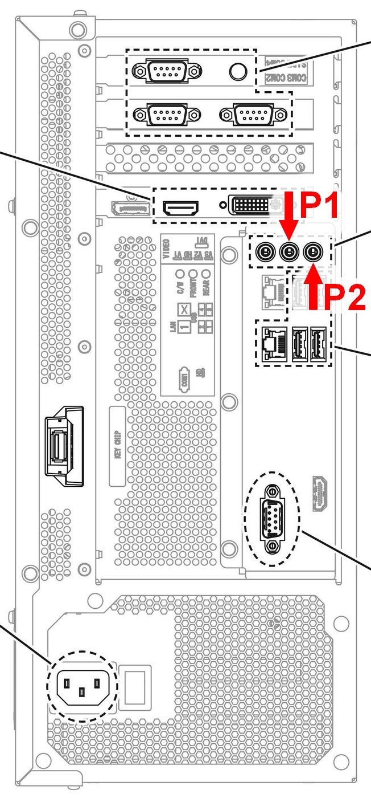
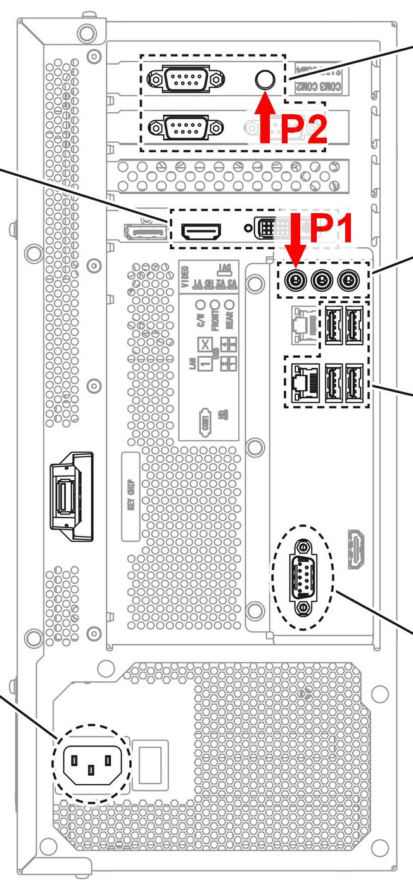

# 🎧 Step 5: Headphone Jacks and Sound System

Unlike FiNALE, which had none, DX natively gives players a **headphone jack with in-game volume control**. Installing it is very simple.

## Connecting the speakers

The cabinet's existing sound system connects without any modification: just plug the jack into the appropriate motherboard port, as explained in [Step 1](step-1-alls-and-psu.md).

- **FRONT**: Player 1 side
- **REAR**: Player 2 side

!!! lightbox
    

## The headphone jacks

The ALLS has 4 audio jacks: three in the usual location and a fourth on the expansion card. The headphone outputs use the two remaining ports:

- **C/W**: Player 1 headphone jack
- **SIDE**: Player 2 headphone jack

!!! lightbox
    

!!! warning
    The ALLS only outputs a **pre-amplified (very weak) sound**. In a real *DX* cabinet, this sound goes through a large dedicated amplifier. A FiNALE cabinet has none for headphones, since it had no headphone jack originally: these outputs cannot be used as they are.

### Installing an amplifier

Since the signal on the C/W and SIDE outputs is too weak, you need to buy **one or two small, cheap audio amplifiers**, one per player, plus 3.5 mm male-to-male jack cables to connect them to the ALLS. Everything is listed in the [shopping list](equipment.md#electronics).

!!! tip "No need for amps with volume knobs"
    On DX, headphone volume is adjusted digitally in the game menus. However, if your FiNALE had already been modified with a headphone jack, you can reuse the amp already in place.

### Installing on the cabinet

The jacks are simple 3.5 mm female Jack connectors. You have two options to install them:

1. **The faithful method:** drill the plastic shell under the buttons (as on a real DX) to embed the jacks.
2. **The non-destructive method:** install the two jacks in the center of the cabinet, between the two players, in a hand-made enclosure.

!!! tip "Jack durability"
    In an arcade, jacks wear out quickly from repeated plugging and unplugging of headphones. Plan for a shell-mounted jack that is **easy to replace**: connect it to the amplifier with a detachable cable rather than soldering the connector directly onto the amp.

## In summary
!!! tldr "The big picture"
    For sound and headphones:

    * Plug the existing speakers into the ALLS FRONT and REAR outputs.
    * Connect the C/W (Player 1) and SIDE (Player 2) outputs to one audio amp each, using 3.5 mm male-to-male jack cables.
    * Connect each amp to a 3.5 mm female jack socket for the headphones.
    * Install the sockets on the shell under the buttons, or in a central enclosure between the players.

---

Let's move on to [Step 6: Lighting](step-6-lighting.md).
