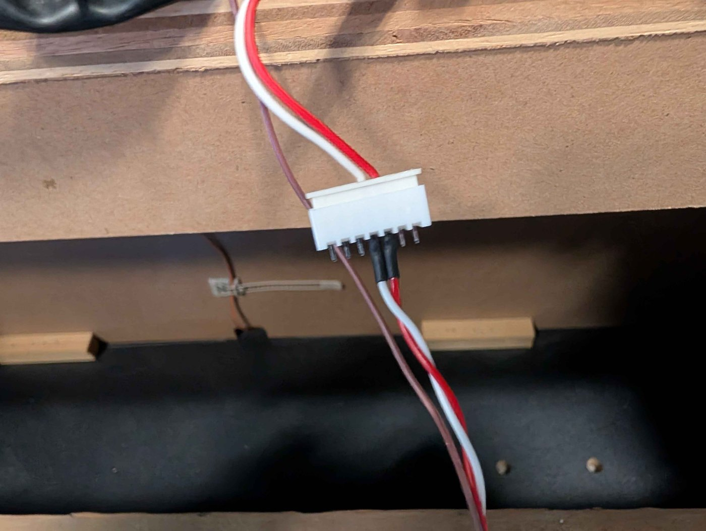
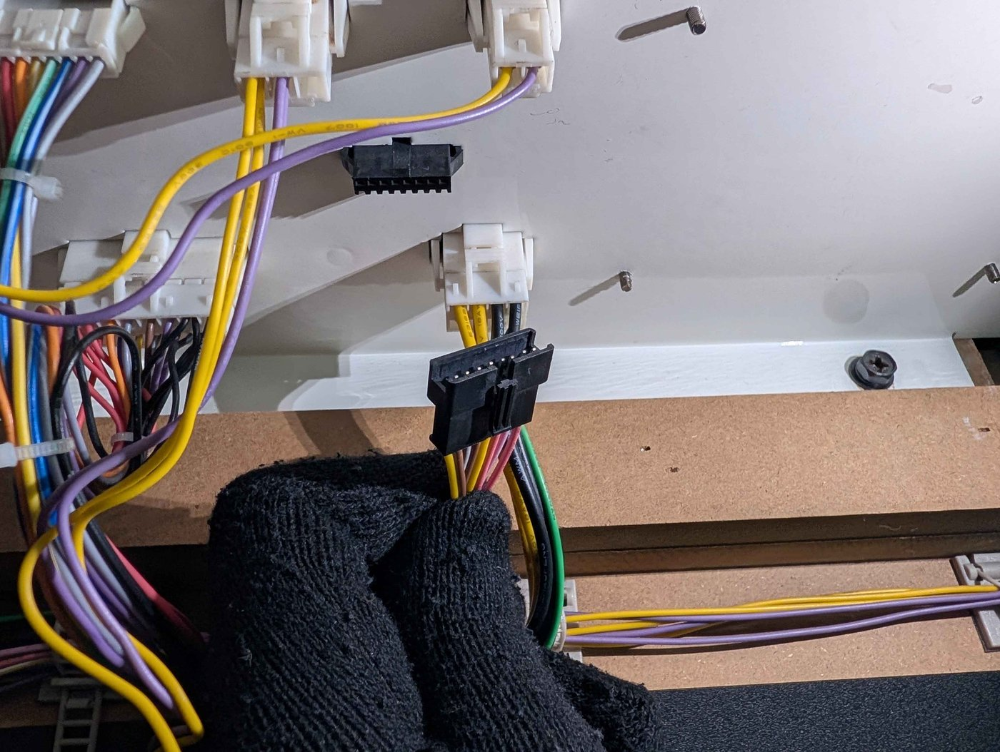

# 💡 Step 6: Lighting

Lighting is technically *optional*: it has no impact on gameplay. But the job is not that complex, and lighting adds a lot to DX's charm. **It is recommended not to skip this step.**

## Technical explanation

??? note "Click here for the technical explanation"
    ### How the LEDs work on a maimai DX

    On a real *DX* cabinet, lighting is driven by three controllers:

    * The **IO4** handles the **billboard** (labeled `BILLBOARD LED` / `ROOF LED` on Sega's diagrams). See [Step 3](step-3-io-board.md).
    * Two identical control boards (part no. `837-15070-04`):
        * P1 side: the eight buttons, the background lighting and the left side lighting.
        * P2 side: the eight buttons, the background lighting and the right side lighting.

    

    Both control boards are connected over RS-232 to a single RS-232 to USB adapter, itself plugged into the same USB hub as the QR-code readers (see [Step 7](step-7-cameras.md)).

    !!! info "COM port software configuration"
        The LED controllers show up on the following virtual COM ports of the ALLS:

        * **COM21** for the P1 LEDs.
        * **COM23** for the P2 LEDs.

    ### How the LEDs work on a maimai FiNALE

    Things are a bit simpler on FiNALE:

    * Unlike DX, no LED goes through the IO3.
    * Two identical control boards handle the LEDs (part no. `837-15070-02-91`):
        * P1 side: the eight buttons, the background lighting, the woofers, and the billboard on the P1 side and in the center.
        * P2 side: the eight buttons, the background lighting, the woofers, and the billboard on the P2 side.

    

    As on DX, these two boards are connected over RS-232 to an RS-232 to USB adapter. Luckily, **it is exactly the same one on FiNALE and DX (part no. `837-15067-02`)**. The only difference: on FiNALE, it plugs directly into a USB port of the RingEdge 2, with no hub.

    ### What this means for a conversion

    * **You need a 4-port USB hub** to reproduce the *DX* wiring on the ALLS.
    * **The billboard must be rewired to the IO4**: on DX, the LED controllers no longer receive any information to light it.
    * Above all, **the FiNALE and DX LED controllers do not have the same part number**. Plugged into an ALLS running DX, a FiNALE controller causes **a non-blocking error at startup**: it reports `837-15070-02-91` while the game expects `837-15070-04`. Fun fact: in this state, the game still sends the button lighting, but not the background lighting.

    Fortunately, all three problems have a solution.

## For the gameplay buttons and the background of both players

For the LED controllers, **DX expects the ID `837-15070-04`**, but the FiNALE ones return `837-15070-02-91`, which puts the game in error. That is the only problem: otherwise, the FiNALE controller is 100% compatible with the instructions sent by DX.

Both controllers therefore need to return the expected ID. A software patch would be simple, but we want to leave the game software untouched: **the solution will be hardware.**

**The solution:** a simple Raspberry Pi Pico, running a dedicated firmware, placed between the LED controller and the RS-232 to USB adapter. It **only modifies the message containing the ID**, and forwards all the others unchanged, in both directions.

The firmware already exists: it is [mailight_pico]({{MAILIGHT_PICO_REPO}}), a port of *[mailight_rs]({{MAILIGHT_RS_REPO}})* by [4ndr3w]({{GITHUB_4NDR3W}}) on GitHub. All that's left is to build the proxy.

### Building a proxy

!!! info "In duplicate"
    You need **two proxies**, one per LED controller. So do every operation twice.

**1. Install the firmware.** Flash mailight_pico onto the Raspberry Pi Pico. If you have never done it, it is extremely simple: [all the instructions are on the project page]({{MAILIGHT_PICO_FIRMWARE_INSTRUCTIONS}}).

**2. Mount the Pico on the `Pico-2CH-RS232`.** Watch the orientation: the markings under the `Pico-2CH-RS232` show where the Pico's USB port should be.

!!! lightbox
    ](../resources/images/step-6-lighting/pico-2ch-rs232.png)

!!! warning "Watch the orientation"
    Make sure your assembly matches the image. If your Pico's USB port ends up, for example, between the two PCBs rather than on the outside, its pins are soldered the wrong way. **Do not try to power it on**, you would damage the `Pico-2CH-RS232`. Resolder the pins the right way, or get a correctly assembled Pico.

**3. Prepare the connectors.** The proxy sits between the LED controller and the RS-232 to USB adapter. The connector differs depending on the side:

* P1 side: **7**-pin JST-XH, male **and** female
* P2 side: **9**-pin JST-XH, male **and** female

!!! lightbox
    
    

To make things easier, reuse the cabinet's colors: **white wire on pin 4, red wire on pin 5**. Wire both connectors so the colors line up when the male is plugged into the female.

These images come from the wiring diagram, but the actual connectors in the cabinet have no `SHIELD` wire: the common ground will therefore have to be connected elsewhere on the `Pico-2CH-RS232`.

!!! lightbox
    
    

**4. Wire the screw terminals.** The **female JST-XH connector goes on the Channel0 terminal** (RS-232 to USB adapter side), the **male JST-XH connector on the Channel1 terminal** (LED controller side):

* Channel0
    * TX0: red
    * RX0: white
    * GND: a black wire, whose other end goes to the GND of the power supply installed in [step 1](step-1-alls-and-psu.md).
* Channel1
    * TX1: white
    * RX1: red

**5. Power the proxy.** The simplest way is to plug a micro-USB cable into the Pico and cut off its other end: **red wire to 5V, black wire to GND** on the power supply installed in [step 1](step-1-alls-and-psu.md).

Your proxy is done!

!!! lightbox
    

### Installing the proxy

For each LED controller:

* Unplug the LED controller's connector and plug it into the proxy's **male connector**.
* Plug the proxy's **female connector** in its place, on the RS-232 to USB adapter.
* Power the proxy.

All that's left is to plug the RS-232 to USB adapter into the ALLS through the USB hub. **The game should recognize the LED controllers natively**, without any software modification.

!!! warning "Plug the adapter in correctly"
    As explained in [step 1](step-1-alls-and-psu.md), **the USB hub must be plugged into USB port #2** of the ALLS, and the RS-232 to USB adapter into that hub. maimai DX is very strict about USB ports: if plugged in wrong, the LEDs will not light up.

## For the billboard and the woofers

??? note "Click here for the technical explanation"
    On FiNALE, the woofers and the billboard share the same circuit: lighting one always lights the other. The woofers are no longer lit on DX, but that is not a problem since the billboard still is.

    However, on DX, **the IO4 handles these LEDs**: the game simply no longer sends this information to the LED controller. The reason for this change remains a mystery, but it means part of the wiring has to be redone.

    Luckily, the FiNALE wiring diagram references a very handy connector, which lets us distribute the signal to the player 1 and player 2 sides without rewiring the whole cabinet:

    !!! lightbox
        
        
        

    The P1 diagram includes a `CENTER LED` element, absent on the P2 side: it is the lighting for the center of the billboard. On DX, this distinction does not exist: even though the signals are separate, the billboard is always the same color on both sides. The simplest solution is therefore to **connect pins `A2`, `A5` and `A8` of the P1 connector to pins `C3`, `C5` and `C8`**, so the center takes the same color as the player 1 side.

Two methods are possible:

* **With the [conversion PCB]({{IO4_CONVERSION_PCB}})**, if you installed it in [step 3](step-3-io-board.md): just plug the LEDs into the right ports on the PCB.
* **Without it**: make your own IO4-compatible wiring harness to connect the LEDs.

??? example "The easy way - The conversion PCB"
    Simply plug the LED controller's output connector into the conversion PCB, then connect the 12V (**watch the polarity**). That's it!

    !!! tip "Use the LED power supply"
        The cabinet comes with a 12V power supply dedicated to the LEDs: use it to power the PCB. **Do not take the IO4's 12V**, and conversely, do not power the IO4 from the LED power supply. The two circuits must share a common ground, but stay separate.

    You will need an extension to reach the existing cable: **2 meters on the player 2 side, 3 meters on the player 1 side**. It is easy to crimp: a `8-position female JST-XH` connector on one end, and an `8-position female JST-SM` on the other.

    !!! lightbox
        : location of connector J22 (`12V input`, watch the polarity) and connectors J23/J24 (`BILLBOARD LED L`/`R`) where the billboard LED harness connects](../resources/images/step-6-lighting/led-inputs-and-12-on-convertion-pcb.jpg)
        

    *If you plan to install the cameras in the next step*, the conversion PCB will make your life easier there too: it already has ready-to-use connectors for their LEDs.

??? example "Making a wiring harness by hand"
    The harness plugs into the IO4 through a 20-pin JST-RA connector (CN9), and ends in two 8-pin JST-SM connectors, for the left and right sides. If you followed the suggestions in [step 3](step-3-io-board.md), you already have a 2-pin JST-SM connector wired to the IO4's CN3 for the `BILLBOARD LED L RED` and `BILLBOARD LED R RED` signals.

    !!! lightbox
        
        

    Build the harness following the diagram below, long enough for a clean installation: **3 meters on the player 1 side, 2 meters on the player 2 side**. For the 12V, **do not use the CN9 12V pin**: connect directly to the cabinet's LED 12V power supply, so as not to put unnecessary load on the I/O board.

    

    Once the harness is done, plug it into the IO4, connect the 12V, then plug the two original 8-pin JST-SM connectors into your new cable. **Test the continuity of all your cables before installing them**, to rule out any badly crimped pin.

    !!! lightbox
        

    !!! tip "The camera LEDs"
        If you plan to install the optional cameras, crimp a few extra connectors now:

        - 2-pin JST-SM on CN9 pins 7 and 8, for the `CAMERA LED WARM` and `CAMERA LED RED` signals respectively.
        - 2-pin JST-SM on CN3 pins 55 and 56, for the `1P CODE READER LED` and `2P CODE READER LED` signals in that order.

## In summary
!!! tldr "The big picture"
    For the button LEDs and the cabinet background:

    * Build two proxies, each based on a Raspberry Pi Pico and a `Pico-2CH-RS232`.
    * Install each proxy between its LED controller and the RS-232 to USB adapter.
    * Plug the adapter into the USB hub, and the hub into USB port #2 of the ALLS.

    For the billboard and the woofers:

    * Either: connect the cabinet's existing connectors to the [conversion PCB]({{IO4_CONVERSION_PCB}}).
    * Or: make and install a wiring harness running from the IO4 and plugging into the cabinet's existing connectors.

---

Final step (optional): the [Cameras](step-7-cameras.md).
