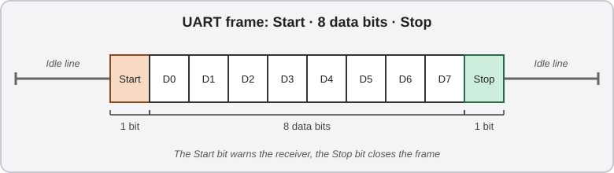
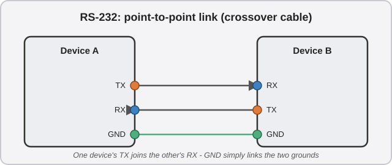
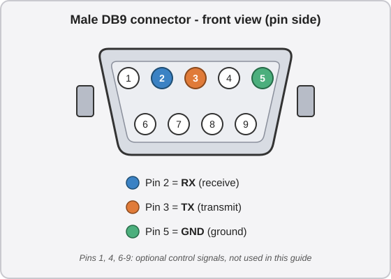
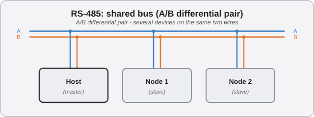
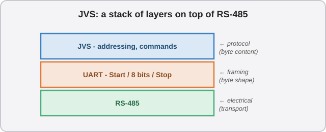
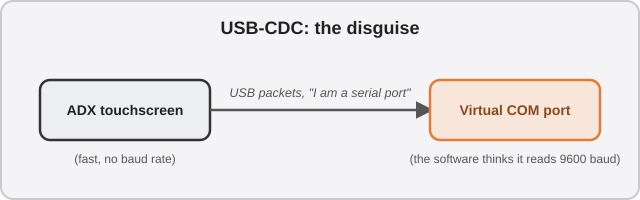

# 🎓 Short course: understanding "serial" protocols

This guide mentions several communication protocols: **UART**, **RS-232**, **RS-485**, **JVS** and **USB-CDC**. If you are new to these technologies, this appendix explains what they are for, what sets them apart, and how two devices manage to "understand each other".

## 1. The common foundation: talking "serially"

A "serial" port sends data **one bit at a time, over a single wire**, in single file (a "parallel" port, on the other hand, uses several wires at once). Each byte is wrapped in a small frame, like a letter in an envelope:

* The **Start** bit warns the receiver that a letter is coming.
* The **next 8 bits** are the content.
* The **Stop** bit closes the envelope.

*There are variants with more or fewer bits, but "8 data bits + 1 Stop bit" is by far the most common.*

This framing is called a **UART** frame (*Universal Asynchronous Receiver-Transmitter*). Originally, UART refers to the chip that builds these frames, but by extension the term also refers to the framing itself. It lives at the level of an electronic chip (a microcontroller, for example), with small "logic" voltages, often called **TTL** (*Transistor-to-Transistor Logic*): 0V for a "0", 3.3V or 5V for a "1".

**RS-232 and RS-485**, covered right after, are simply **two ways of electrically translating this same framing**, to send it over a longer or more reliable cable. Like the same letter handed to two different postal services: what is written on it does not change.

**The role of the "clock":** to read a sequence of bits correctly, you need to know exactly when to look at the line, like a metronome keeping time for musicians. In electronics, this timing signal is called a **clock**. Nothing to do with a wall clock: it is a signal that repeats "now, now..." at a fixed interval, telling each device to read the next bit.

That is exactly what the "A" in UART means, for *Asynchronous*: **there is no wire dedicated to the clock**. Each device has to find the right rhythm on its own, using its own internal clock, set in advance to the agreed rate.

**How communication is established:** both devices must therefore agree on this speed in advance: this is the famous **baud rate** (for example, "9600 baud" = 9,600 bits per second). **No negotiation happens on the wire**: if both ends are not set to the same speed, each one reads the wrong bit at the wrong time. It is a convention fixed in advance, not a handshake.

## 2. RS-232: point to point

RS-232 translates this UART framing into **higher and inverted voltages**: typically between -15V and +15V, often ±5 to ±12V in practice. A logical "1" becomes a negative voltage, a "0" a positive one. This allows longer cables than the weak 3.3V/5V of raw UART. RS-232 only links **two devices**, each with its own transmit wire:

{ width="65%" }

The **TX** (transmit) of one side connects to the **RX** (receive) of the other: this crossing is what a [Null Modem adapter](glossary.md#communication-and-protocols) does. RS-232 is not limited to voltages, by the way: the standard also defines the connector (the famous "DB9" port) and a few extra control wires, which is precisely what makes this kind of crossover cable possible.

In this guide, **RS-232 is the protocol the game uses** to:

* drive the [LED controllers](step-6-lighting.md);
* talk to the *original* touchscreens;
* read information from the Aime reader and tell the VFD what to display.

It is a widespread standard in the arcade world.

**The DB9 connector:** this small trapezoidal 9-pin connector on two rows, which RS-232 made almost universal, is often wrongly mistaken for an "inverted" VGA port. You find it on the RingEdge 2 as well as on the ALLS. Of the 9 pins, **only three really matter to us**:

* **TX**: transmit;
* **RX**: receive;
* **GND**: ground, the common voltage reference.

The other pins (DTR, DSR, RTS, CTS, DCD, RI) carry optional control signals (flow control, carrier detection...), rarely used in arcade. *The VFD is an exception: it also uses `RTS` and `CTS` (see [step 4](step-4-aime-reader.md)).*

{ width="65%" }

A **female** connector has the same pin numbers, but recessed rather than protruding, and mirrored horizontally. That is why a crossover (Null Modem) cable must explicitly **swap pins 2 and 3** from one end to the other. Connecting two devices "straight through" (pin 2 to pin 2, pin 3 to pin 3) would tie two TX together and two RX together, which does not work: **one device's TX must always go to the other's RX**, and vice versa.

## 3. RS-485: the multi-device bus

RS-485 also translates the UART framing, but with a different trick. Instead of a "high/low" wire measured against ground, it uses a **differential pair**: two wires, A and B, whose voltage is compared *with each other*, at levels close to the original TTL.

Two advantages:

* **much better noise immunity** on long cables;
* above all, **several devices can share the same pair of wires**:

{ width="80%" }

However, RS-485 says nothing about **who may talk, and when**: without a rule, devices would talk at the same time and their signals would mix. The protocol above sets that rule. This ability to chain several devices on two wires makes it the ideal medium for JVS (see next section).

## 4. JVS: a protocol built on top of RS-485

Be careful not to mix up the layers: **RS-485 only defines the electrical side** (how bits travel on the wire). **JVS is a layer above**, defining a common language (addressing, commands) so that the game and the I/O board understand each other.

**The link with the UART from section 1:** JVS does not reinvent how bits are sent. It uses **exactly the same UART frames** (Start / 8 data bits / Stop), simply carried over RS-485. What JVS adds is a convention on the *content* of those bytes. A JVS packet always contains, in order:

1. a sync byte;
2. an address byte, which designates the recipient;
3. a length;
4. the command data;
5. a checksum, to detect errors.

The game and the I/O board therefore exchange plain UART bytes, like any serial device: it is by interpreting their content according to the JVS rules that both ends understand each other.

{ width="80%" }

**How communication is established:**

1. At startup, the game (the host) sends a **reset command** to every device on the bus at once.
2. It then asks, still to everyone: "who does not have an address yet? Answer me". An extra wire, daisy-chained from one device to the next, lets only one device answer at a time. The host thus assigns **an address to each device, one by one**: this is JVS auto-addressing.
3. Once the addresses are handed out, the host **polls each board in turn** ("anything new?").

It is a **master/slaves** dialogue: only the host takes the initiative. In an arcade system, it is typically the I/O board that speaks JVS. Despite its USB cable, it actually always communicates over an RS-485 serial link under the hood.

## 5. USB-CDC: the disguise

USB is a completely different protocol family: **packet-based, much faster, and negotiated**. On connection, the device introduces itself to the computer and describes its own capabilities: this is "USB enumeration".

The **CDC** class (*Communication Device Class*) is a special case: the device tells the computer *"treat me like an RS-232 port"*. The computer then creates a **virtual COM port**, but the actual transport remains packet-based USB:

{ width="80%" }

It is convenient for compatibility: a program that only speaks RS-232 works without modification.

But be careful: **the displayed rate is just a facade**. The virtual COM port may announce "9600 baud", but the USB hardware behind it keeps sending data at full speed. The disguise itself does not create a bottleneck: the bottleneck appears when this fast data has to be passed on to a device *actually* limited to 9600 baud, like the game, further down the chain. It is one of the problems encountered with the ADX touchscreens, an alternative mentioned in the [Shopping list](equipment.md).

## Quick summary

| Protocol | Layer | Topology | Establishing the link |
|---|---|---|---|
| UART | Framing + logic (TTL, 3.3V or 5V) | Point to point (before any electrical medium) | Baud rate fixed in advance on both sides: the common foundation for everything that follows |
| RS-232 | Electrical + connector (translates UART) | Point to point (2 devices) | Same as UART, simply carried at higher voltages |
| RS-485 | Electrical (translates UART) | Bus (several devices) | Same as UART; handles neither addresses nor turn-taking, that is the job of the protocol above (e.g. JVS) |
| JVS | Protocol (above UART, transported over RS-485) | Master/slaves chain | The host resets the bus, then hands out the addresses one by one at startup |
| USB-CDC | Protocol (above USB) | Point to point | Negotiated on connection (USB), then disguised as a serial port |

---
