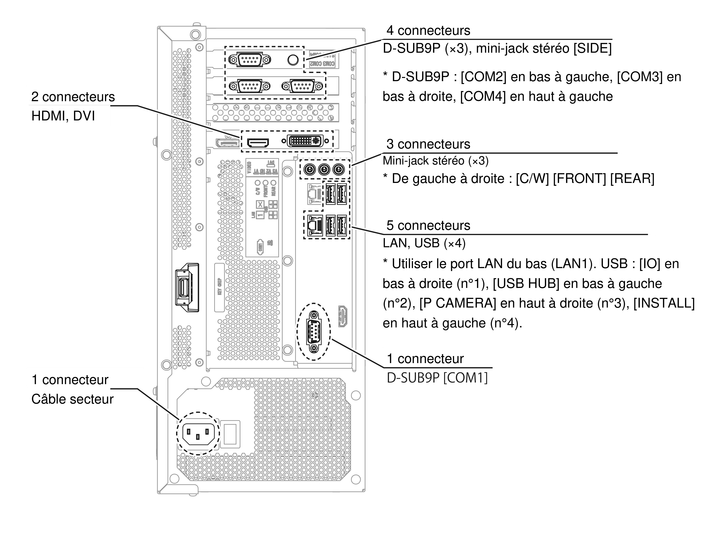
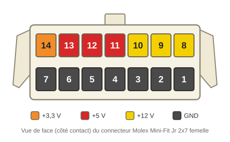

# 🛠️ Étape 1 : Le remplacement du PC central (ALLS)

## Explications techniques

??? note "Cliquez ici pour l'explication technique"
    L'ancien PC *RingEdge 2* ne peut pas faire tourner *DX* : il vous faut un PC **ALLS HX2**.  
    En plus d'un matériel plus récent et plus performant, le système d'exploitation change radicalement entre les deux machines. **Le remplacement est obligatoire.**
    
    Un **ALLS MX2** convient également : ses caractéristiques dépassent le minimum requis pour *DX*. En principe, **tous les ALLS de deuxième génération** (ceux dont la référence se termine par 2) **sont compatibles d'un point de vue logiciel**, mais certains manquent de puissance pour faire tourner le jeu correctement. C'est le cas par exemple du **ALLS X2** : compatible, mais trop faible pour une expérience agréable. Ces modèles peuvent être mis à niveau, mais l'opération devient vite complexe : *mieux vaut se procurer directement un modèle adapté.*

    Un ALLS ressemble beaucoup à un PC gaming moderne, avec deux particularités :

    - **Un port USB renfoncé** sur le dessus de la carte mère, réservé au **keychip**. Cette clé USB identifie le propriétaire de la borne sur le réseau officiel Sega et déchiffre les données de jeu.
    - **Deux cartes d'extension** (sur les modèles de deuxième génération), qui ajoutent trois ports série RS-232 et une prise jack 2,5mm. Avec le port COM de la carte mère, ces ports série servent à connecter le lecteur Aime, le VFD et les dalles tactiles des deux écrans. La prise jack est dédiée à l'une des deux prises casque.

    !!! tip "L'alimentation électrique du ALLS"
        L'alimentation du ALLS commute automatiquement sa tension : son connecteur C13 accepte indifféremment du 100V, 110V, 220V ou 240V. **Aucun transformateur externe n'est nécessaire.**

    !!! warning "Stockage"
        Un ALLS HX2 de *DX* officiel contient **deux disques** : un SSD de 120Go et un disque dur de 500Go (nommé "SUB STORAGE"). **Le jeu a besoin des deux**, le SSD seul ne suffit pas. Si votre ALLS n'a qu'un seul disque, vous devrez en installer un second.

        Pour cela, consultez le [Service Manual ALLS HX2](../resources/pdfs/alls-hx2-service-manual-full.pdf) : **brancher le disque ne suffit pas**, une étape logicielle détaillée dans le manuel est également nécessaire.

## Installation dans la borne

### Extraire le RingEdge 2 et libérer le compartiment du PC

Commencez par **débrancher tous les connecteurs du RingEdge 2** et sortez-le de la borne. Il ne servira plus : ne le conservez que si vous envisagez de reconvertir un jour la borne en FiNALE.

!!! tip "Sortez la planche entière"
    Selon le modèle de votre borne, le RingEdge 2 est probablement monté sur une planche. Si c'est le cas, retirez directement la planche plutôt que de vous battre avec les vis peu accessibles qui maintiennent le PC.

La plupart des composants voisins peuvent aussi être retirés. À droite du RingEdge 2, vous trouverez **trois PCB** :

- **L'IO3**, tout en haut, reconnaissable à la grosse nappe qui y est raccordée.
    * **À retirer**, avec son câble USB : elle est remplacée par l'IO4 sur *DX*.
- **L'adaptateur RS-232 vers USB**, en bas à gauche, relié au RingEdge 2 en USB. Deux connecteurs à deux fils sont normalement branchés sur sa rangée du bas.
    * **À conserver** : cette carte fait le lien entre les contrôleurs de LEDs et le PC. Profitez-en pour la sortir et la dépoussiérer, vous la réinstallerez plus tard.
- **Le contrôleur des dalles tactiles de FiNALE**, en bas à droite, relié au RingEdge 2 par un câble à trois fils terminé par un DB9.
    * **À retirer**, avec son câble et les deux câbles blancs raccordés en dessous : les dalles tactiles de *DX* sont radicalement différentes et n'utilisent plus ce composant.

Une fois ces trois PCB retirées, faites le ménage : **vous aurez besoin de tout l'espace disponible.** Si le RingEdge 2 était monté sur planche, vous devriez maintenant disposer d'une surface parfaitement plane. *S'il reposait sur deux lattes de bois, retirez-les également.* Dans la mesure du possible, fixez les câbles le long des parois latérales plutôt qu'au sol, afin de libérer un maximum de place.

**Le routeur et la caméra de FiNALE** peuvent aussi être retirés : le routeur servait notamment à relier la caméra au RingEdge 2, et cette caméra ne sert plus sur *DX*. Pensez également à retirer le câble audio jack 2,5mm qui reliait la caméra au RingEdge 2.

#### Les câbles vidéo

À l'origine, les bornes maimai pré-*DX* relient leurs écrans au RingEdge 2 par **deux câbles DVI vers VGA** (côté VGA sur l'écran). Un choix qui reste un mystère, puisque les deux écrans disposent d'une entrée DVI : beaucoup d'exploitants les ont donc remplacés par de simples câbles DVI vers DVI. Selon l'historique de votre borne, vous trouverez l'un ou l'autre :

- **Joueur 1** : retirez le câble, quel qu'il soit.
- **Joueur 2** : **conservez-le s'il s'agit d'un DVI vers DVI**, retirez-le s'il s'agit du DVI vers VGA d'origine.

!!! success "Ce qui doit rester"
    De la connectique d'origine du RingEdge 2, il ne devrait plus vous rester que :

    - les deux câbles audio jack 2,5mm des haut-parleurs joueur 1 et joueur 2
    - le câble Molex Mini-Fit Jr (alimentation)
    - éventuellement, le câble DVI vers DVI de l'écran joueur 2

### Installation du ALLS

Le ALLS est plus large que le RingEdge 2, mais l'espace que vous venez de libérer permet de l'installer confortablement, ainsi que les différentes PCB que nous y raccorderons par la suite. Sur les bornes *DX* officielles, le ALLS est d'ailleurs installé *à la verticale* : c'est une option si vous manquez de place. **L'essentiel est que le PC soit solidement fixé** et ne puisse pas bouger si la borne est déplacée.

Une fois le ALLS en place, vous pouvez déjà :

- **Fixer l'IO4**, idéalement à l'emplacement de l'ancienne IO3 pour profiter de la proximité des câbles d'alimentation d'origine. Si vous avez opté pour la [PCB de conversion]({{IO4_CONVERSION_PCB}}), prévoyez aussi sa place.
- **Réinstaller l'adaptateur RS-232 vers USB.**
- **Brancher le hub USB sur le port USB 2 du ALLS**, puis y raccorder l'adaptateur RS-232 vers USB.
- **Installer votre nouvelle alimentation à découpage 5V/12V** (voir [Alimentation](#alimentation)). Idéalement, placez-la côté joueur 1 avec les autres alimentations à découpage, même si cela demande des câbles plus longs.

Les autres câbles seront rebranchés au fil des étapes suivantes.

## Branchements

Voici la planche du [manuel officiel maimai DX](../resources/pdfs/maimai-dx-instruction-manual-full.pdf) (page 128) qui détaille toute la connectique d'un ALLS HX2. Voyons chaque connexion en détail.

!!! lightbox wide
    

La plupart des appareils à connecter sont présentés plus en détail dans les étapes suivantes : en cas de doute sur un branchement, terminez d'abord le chapitre correspondant, puis revenez sur cette page. **D'après le manuel officiel de *DX*, l'ordre des ports USB a son importance** : respectez l'attribution ci-dessous.

### PSU interne

- **Connecteur C13** : Raccordement au secteur, accepte toute tension d'entrée de 100V à 240V.

### Keychip

- **Port USB** : Réservé au keychip. Ne peut **pas** servir de port USB classique.

### Carte mère

- **COM1 - Port DB9** : Lecteur Aime
- **LAN1 - Port RJ45** : Port réseau, à connecter au routeur de service. Le second port réseau est inutilisé.
- **Audio Jacks 2,5mm** :
    - **C/W** : Prise casque Joueur 1
    - **FRONT** : Haut-parleurs Joueur 1
    - **REAR** : Haut-parleurs Joueur 2
- **USB** :
    - **USB 1** : SEGA IO4
    - **USB 2** : Hub USB, sur lequel sont branchés les deux caméras de QR codes et l'adaptateur `4x RS-232 vers USB`.
    - **USB 3** : Caméra des joueurs
    - **USB 4** : Port d'installation, pour y insérer une clé USB contenant les données de jeu à installer.

### Carte graphique

- **HDMI** : Raccordé à l'écran du joueur 1 via un câble HDMI - DVI-D.
- **DVI** : Raccordé à l'écran du joueur 2 via un câble DVI-D.
- **DisplayPort** : Inutilisé, duplique le signal vidéo du joueur 1.

### Cartes d'extension

- **COM2 - Port DB9** : VFD
- **COM3 - Port DB9** : Dalle tactile du joueur 1
- **COM4 - Port DB9** : Dalle tactile du joueur 2
- **SIDE** : Prise casque Joueur 2

## Alimentation

La plupart des branchements sont assez intuitifs, mais **un connecteur indispensable du RingEdge 2 n'a pas d'équivalent sur le ALLS** : celui qui alimente les périphériques externes.

Sur le RingEdge 2, à côté du port du keychip, sort un **connecteur Molex Mini-Fit Jr 2x7 broches femelle**. Il relie plusieurs éléments de la borne, dont l'IO3, à l'alimentation interne du PC. Plutôt que de recâbler toute la zone, **le plus simple est de fabriquer un petit adaptateur** à partir d'un connecteur Molex Mini-Fit Jr identique, relié à une **alimentation à découpage fournissant du 5V et du 12V** (typiquement un modèle en boîtier métallique à bornier à vis, comme ceux de la marque Mean Well). Le connecteur d'origine fournit aussi du 3,3V, mais aucun matériel de la zone ne l'utilise.

!!! warning "Ne réutilisez pas les alimentations de la borne"
    Ce faisceau va notamment alimenter l'IO4. Réutiliser l'alimentation 5V existante n'aurait que peu de conséquences, mais **réutiliser l'alimentation 12V des LEDs serait une erreur** : pour éviter tout courant de retour, l'IO4 et les LEDs doivent chacune disposer de leur propre alimentation, l'IO4 n'étant pas conçue pour supporter une telle intensité.

!!! warning "Raccordez les masses"
    **Reliez le GND de votre nouvelle alimentation à celui d'une alimentation déjà en place dans la borne.** Une alimentation laissée flottante peut engendrer toutes sortes de problèmes inattendus.

Câblez le connecteur femelle en suivant le schéma ci-dessus. Il est représenté **de face, côté contacts** : ne le confondez pas avec le côté câbles.

- Broche 14 : **3,3V** (optionnel, inutilisé)
- Broches 13-11 : **5V**
- Broches 10-8 : **12V**
- Broches 7-1 : **GND**

Raccordez chaque fil au terminal correspondant de votre alimentation. Peu de courant traverse ce faisceau (moins de 3A au total, toutes tensions confondues), mais **assurez-vous d'utiliser une section adaptée** : du **20 AWG** (0,5mm²) est idéal. Le fil 22 AWG de la [liste du matériel](equipment.md) convient aussi, puisque chaque tension est répartie sur plusieurs broches. Vérifiez simplement que vos cosses Mini-Fit Jr acceptent la section choisie (les modèles 18-24 AWG sont les plus courants).

Il ne vous reste plus qu'à brancher votre connecteur maison sur le câble d'origine.

!!! warning "L'alimentation doit être solidement fixée"
    La borne subit beaucoup de mouvements : **l'alimentation ne doit en aucun cas pouvoir bouger ou se renverser.** Vissez-la solidement au plancher du compartiment.

## En résumé
!!! tldr "Les grandes lignes"
    Pour le ALLS et l'alimentation :

    * Sortir le RingEdge 2 et libérer le compartiment (IO3, contrôleur tactile FiNALE, routeur, caméra)
    * Installer le ALLS HX2 à sa place et le fixer solidement
    * Raccorder les différents périphériques au ALLS (voir étapes suivantes)
    * Confectionner un câble adaptateur pour la connectique d'alimentation externe
    * Installer l'alimentation externe et le câble adaptateur dans la borne, raccorder le connecteur existant

---

Passons à l'[Étape 2 : Affichage et dalles tactiles HDX](step-2-touchscreen-display.md).
