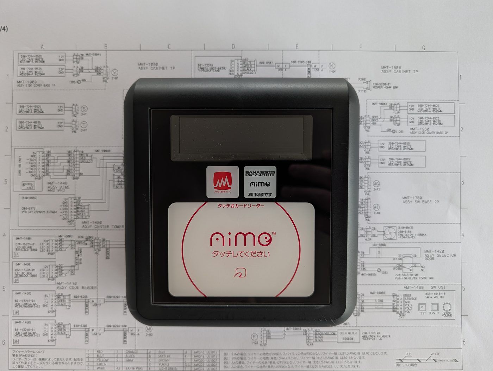
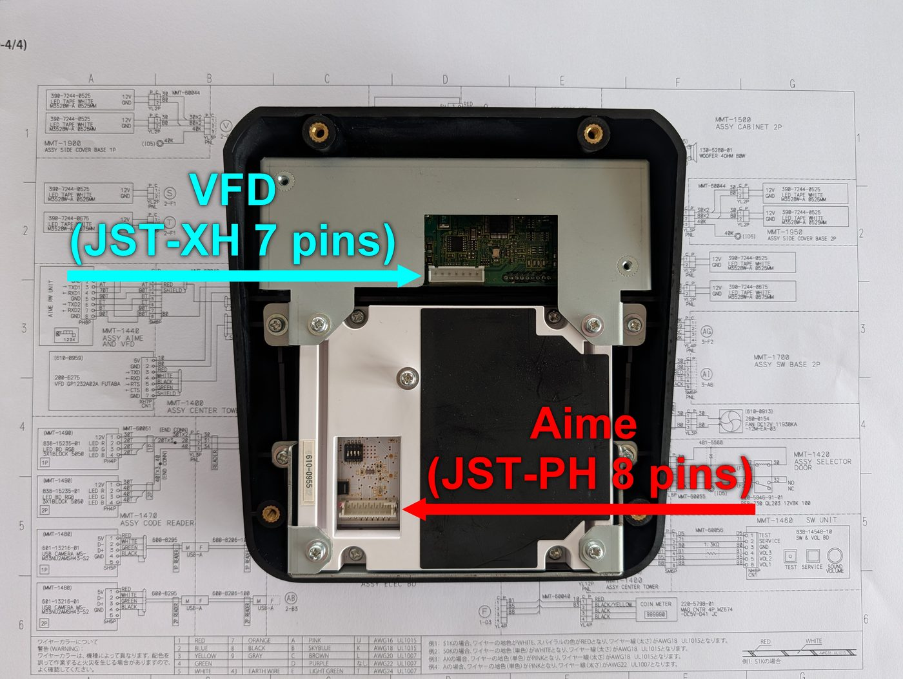
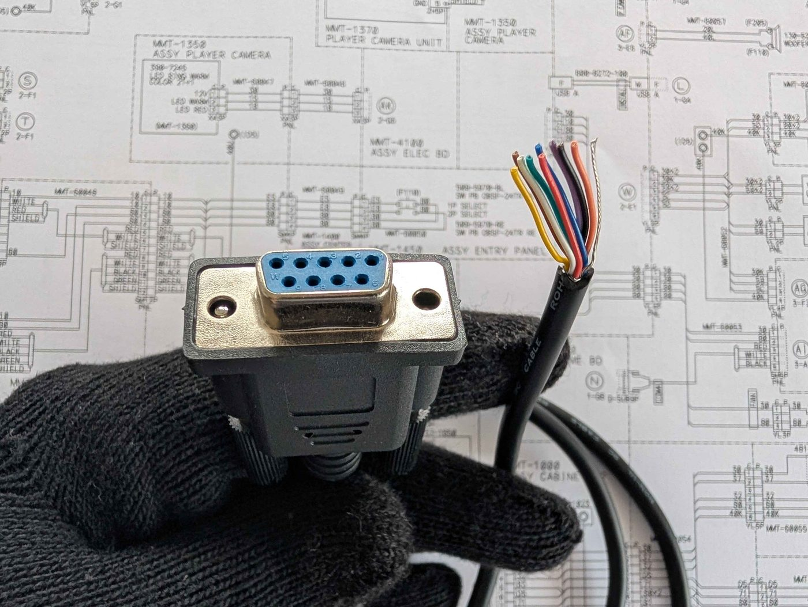
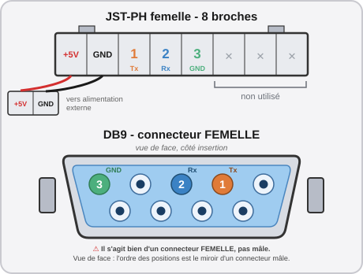
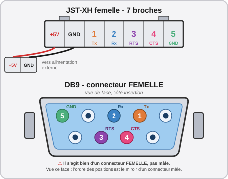
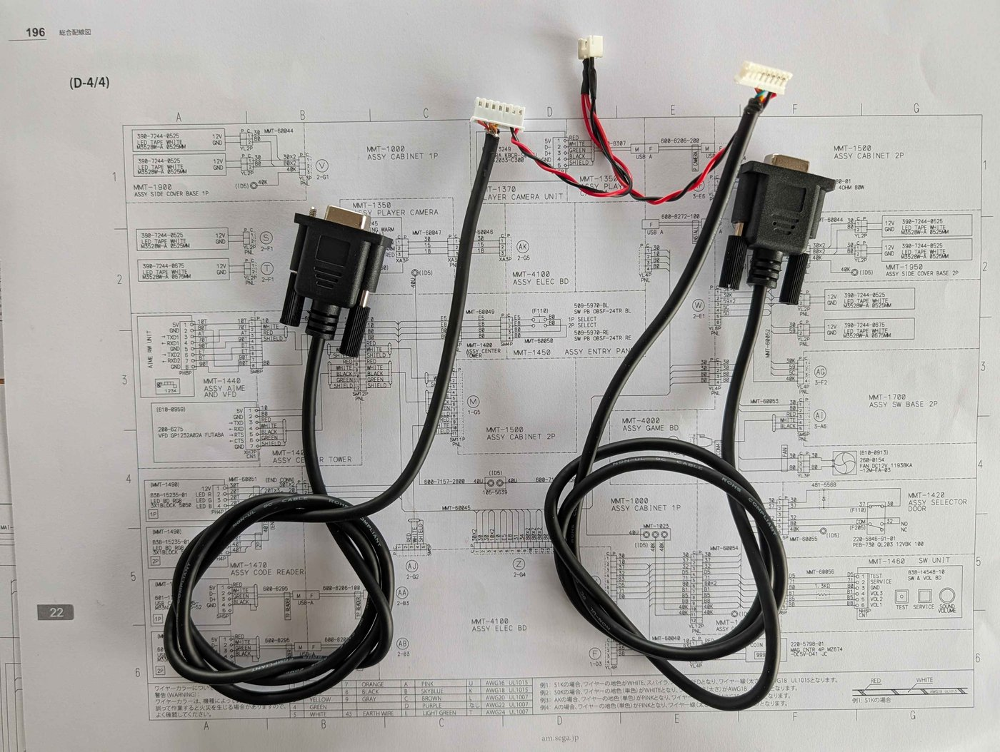
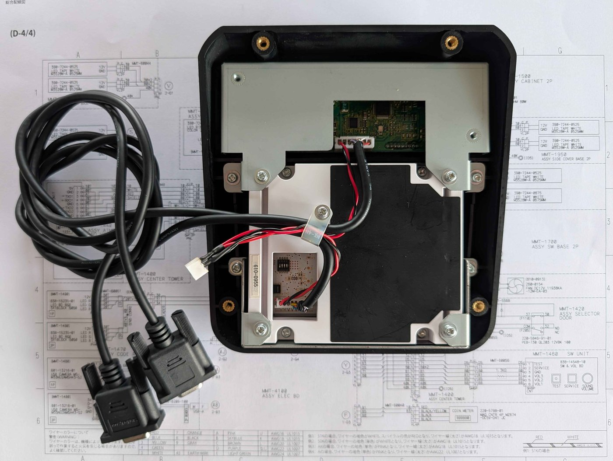
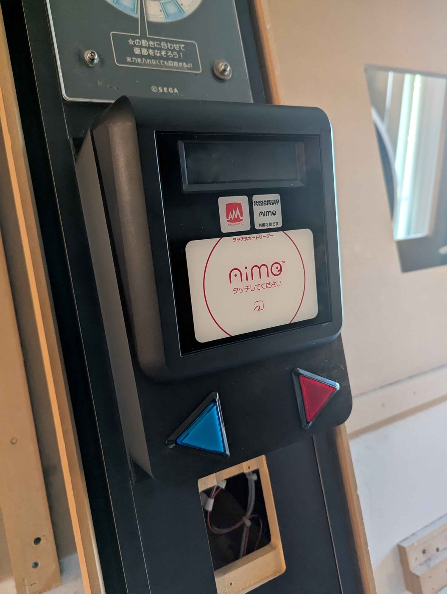

# 💳 Étape 4 : Le lecteur Aime et le VFD

Les lecteurs Aime de FiNALE ne sont pas compatibles avec DX. Il est nécessaire d'installer une nouvelle version. De plus, bien qu'il n'ait aucun usage réel pour notre conversion, le VFD est également une addition nécessaire. Heureusement, ils sont très simples à installer.

## Explications techniques

??? note "Cliquez ici pour l'explication technique"
    FiNALE utilise un système à base de deux lecteurs Aime d'ancienne génération, chaînés l'un sur l'autre. Le lecteur du haut lit la carte pour le joueur de gauche, et celui du bas pour le joueur de droite. Sur DX, il n'y a plus qu'un seul lecteur, et lorsqu'une carte est scannée, le profil apparaît sur les deux écrans. Le propriétaire du profil peut alors simplement confirmer la connexion sur son écran ; le second joueur est ensuite libre de scanner sa propre carte. La technologie utilisée est également complètement différente. Il est impossible de réutiliser un lecteur Aime de FiNALE.

    !!! info "aic_pico"
        Il est techniquement possible d'utiliser un [aic_pico](https://github.com/whowechina/aic_pico), un projet open-source qui reproduit le fonctionnement d'un véritable lecteur Aime de façon transparente pour le jeu. Ceux-ci sont beaucoup moins chers à produire qu'un véritable lecteur Aime, mais nécessiteraient une bonne dose de bricolage pour être branchés sur le port DB9 correspondant du ALLS.

    Quoi qu'il en soit, les lecteurs Aime de dernière génération ne sont pas si rares, et viennent souvent en combo avec le VFD dont nous avons également besoin. La particularité de cette dernière génération est d'être techniquement compatible avec le paiement électronique ; toutefois, même au Japon, cette fonctionnalité n'est presque jamais utilisée. Les exploitants préfèrent typiquement installer leur propre terminal sur la borne, plus flexible, proposant plus d'options de paiement.

## La connectique

Le branchement au ALLS en lui-même est extrêmement simple :

* Lecteur Aime : **COM1**
* VFD : **COM2**

Les deux ports COM sont des ports DB9 physiques de la carte mère du ALLS. Toutefois, votre combo Aime + VFD n'est probablement pas arrivé avec un câble DB9 que vous pouvez simplement brancher. **Nous allons devoir sertir nos propres câbles**, qui viendront s'interfacer avec les connecteurs du lecteur Aime et du VFD.

!!! lightbox
    
    

Prenez votre câble DB9 femelle-femelle, et **coupez-le en deux à la moitié du câble** pour en exposer les fils. Vous avez deux options :

* Soit vous prenez un câble qui, une fois coupé en deux, est assez long pour parcourir proprement toute la distance du ALLS au centre de la borne, là où sera installé le lecteur Aime + VFD.
* Soit vous préférez couper le câble à une vingtaine de centimètres pour exposer un connecteur DB9 femelle flottant que vous pourrez ensuite raccorder au ALLS via un simple câble DB9 mâle-femelle de taille appropriée.

La seconde option est plus pratique à manipuler, évite de devoir gérer une longueur de câble déraisonnable pendant le sertissage du connecteur et facilite également l'installation. De plus, cela rendra le combo plus facile à débrancher si vous devez un jour le démonter pour maintenance.

!!! lightbox
    

### Confection du câble pour le lecteur Aime

Le lecteur Aime est le plus simple des deux : il ne nécessite que 5 fils, bien que le connecteur présente 8 broches.

Tous les câbles DB9 sont différents, le vôtre n'aura sans doute pas les mêmes couleurs de fils qu'un autre. À partir de là, la solution la plus simple pour être sûr de ne pas se tromper est d'utiliser un multimètre en mode continuité.

* Mettez la pointe de votre multimètre dans le trou de la fiche DB9 femelle correspondant à la broche que vous souhaitez câbler. *(Voir schéma ci-dessus)*
    * Si la pointe de votre multimètre est trop large pour entrer, utilisez un fil Dupont mâle raccordé à la pointe de touche.
* Avec la seconde pointe, touchez les fils un par un jusqu'à entendre le signal sonore. **Le fil qui sonne est celui qui correspond à votre broche.** Repérez-le.
* Après avoir repéré tous les fils utiles *(3 dans le cas du lecteur Aime, 5 dans le cas du VFD)*, coupez tous les autres.
* Sertissez les fils restants avec des broches **JST-PH femelle**, puis insérez-les dans votre connecteur JST-PH 8 broches femelle.

Une fois ceci fait, vous avez presque terminé. Il vous reste à sertir deux fils supplémentaires avec deux broches **JST-PH mâle**, idéalement un fil de couleur rouge que vous viendrez connecter à la broche 5V du connecteur, et un fil noir que vous brancherez à la broche GND juste à côté. Le connecteur final devrait avoir un total de 5 fils, dont 3 connectés à la prise DB9 et 2 "flottants" qui seront raccordés par la suite à l'alimentation.

{ width="80%" }

!!! warning "Attention aux GNDs"
    Vous aurez peut-être remarqué que deux des broches que vous devez sertir sont des GND, la masse commune. Puisque, comme son nom l'indique, la masse commune est commune, vous pourriez envisager de n'en sertir qu'un seul. Cela serait fonctionnel, mais préférez les deux : un pour aller de pair avec le 5V et couvrir l'alimentation du lecteur, et l'autre pour être connecté au port DB9 selon le standard de la communication en RS-232.

### Confection du câble pour le VFD

Le VFD présente un connecteur 7 broches et toutes doivent être serties pour qu'il puisse fonctionner.

L'opération est donc presque exactement la même que pour le JST-PH du lecteur Aime, si ce n'est que le connecteur du VFD est un JST-**X**H. De plus, pour le VFD vous devrez également raccorder au port série les fils pour le signal `CTS` et le signal `RTS`.

{ width="80%" }

Une fois cette étape terminée, félicitations, vous avez confectionné vos propres câbles pour la connexion au ALLS.

!!! lightbox
    

!!! tip "Sertissez un connecteur pour les fils d'alimentation"
    Sur le connecteur du lecteur Aime et sur celui du VFD, nous avons installé deux fils supplémentaires pour l'alimentation 5V et le GND. Pour une installation plus simple, récupérez les deux paires de fils, sertissez les deux 5V ensemble et les deux GND ensemble en Y sur un seul connecteur JST-SM à côté de vos deux câbles DB9. Il sera ainsi plus simple d'installer le matériel sur la borne et de le débrancher au besoin en cas de maintenance.
    

### Sécurisez les câbles

Branchez les deux câbles que vous venez de confectionner sur les ports correspondants. Sécurisez-les ensuite à l'arrière du combo lecteur Aime + VFD pour vous assurer qu'ils ne subiront aucune tension. En effet, même avec la meilleure technique de sertissage du monde, nos connecteurs resteront fragiles. Une fois les connecteurs branchés et sécurisés, il ne nous reste qu'à installer le combo sur la borne.

!!! lightbox
    

## Installation sur la borne

Vous pouvez utiliser [le modèle 3D conçu par SpiralGlide](spiralglide-resources.md#support-du-lecteur-aime) qui s'installe sur la borne grâce aux vis existantes pour la vitre en acrylique. Celui-ci a été conçu spécifiquement pour le lecteur aime provenant de Star Horse 4, et s'intègre de façon non-destructive à la borne en profitant des trous existant pour les lecteurs aime. Celui-ci comprends également un emplacement pour les boutons 1P SELECT et 2P SELECT pour pouvoir les intégrer facilement.

!!! lightbox
    

## Dernière étape

Maintenant que le combo est installé sur la façade de la borne, il n'y a plus qu'à raccorder les deux câbles aux connecteurs DB9 du ALLS. Pour rappel, le lecteur **Aime va sur le COM1**, et le **VFD sur le COM2**.

Une fois le ALLS raccordé, n'oubliez pas de connecter également l'alimentation 5V des deux connecteurs ; vous pouvez les raccorder à l'alimentation 5V que nous avons installée à [l'étape 1](step-1-alls-and-psu.md).

Pensez également à confirmer le bon fonctionnement de votre travail avant de passer à la suite.

## En résumé
!!! tldr "Les grandes lignes"
    Pour le lecteur Aime et le VFD :

    * Fabriquer un câble DB9 femelle pour le lecteur Aime.
    * Fabriquer un câble DB9 femelle pour le VFD.
    * Sécuriser les câbles pour qu'ils ne bougent pas.
    * Installer le combo en façade sur la borne.
    * Brancher les deux connecteurs sur le ALLS.
    * Raccorder l'alimentation.

---

Passons à l'[Étape 5 : Prises casques et Système Son](step-5-audio-headphones.md).
