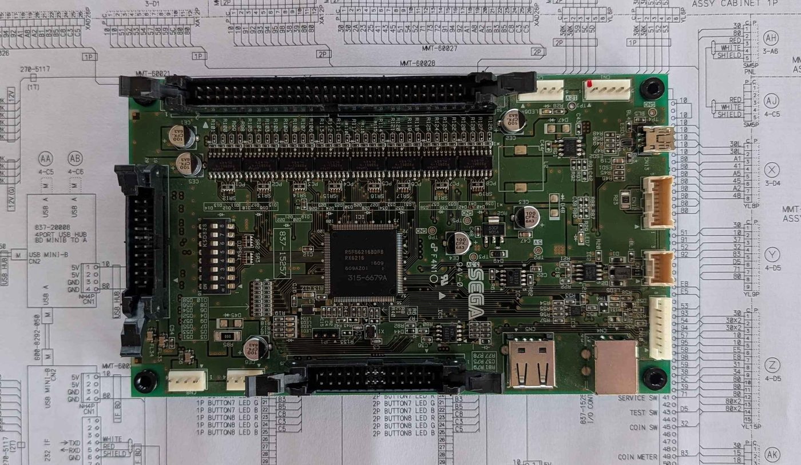
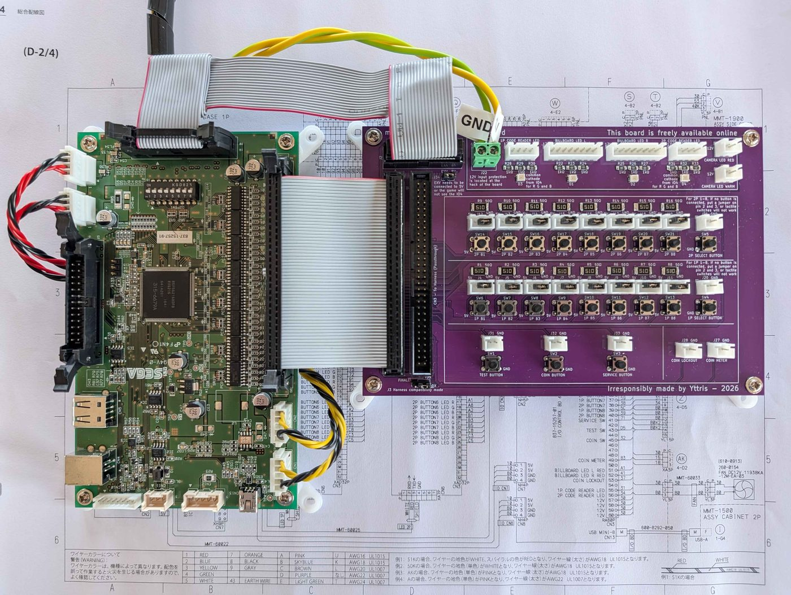

# 🕹️ Étape 4 : La Carte I/O et les Boutons

Pour faire tourner *DX*, **l'IO3 de FiNALE doit être remplacée par une IO4**, plus récente. Côté boutons, les deux modèles diffèrent peu, mais le câblage doit tout de même être adapté.

## Explications techniques

??? note "Cliquez ici pour l'explication technique"
    Le passage à l'IO4 entraîne deux modifications majeures du câblage de la borne DX par rapport à FiNALE :

    * **Le harnais de câbles a été modifié** : il intègre les deux boutons 1P SELECT et 2P SELECT, et le Coin Locker passe de la broche 51 à la broche 53.
    * **L'IO4 gère désormais l'éclairage** de plusieurs parties de la borne.

    Le premier point est simple, le second bien plus contraignant : **6 signaux LEDs passent désormais par l'IO4**, là où les contrôleurs de LEDs géraient seuls l'éclairage sur FiNALE.

    Autre changement : **l'IO4 communique avec le PC en USB**, et non plus en JVS comme sur RingEdge 2. *Certaines variantes d'IO4 gèrent aussi le JVS, mais peu importe ici : la connexion se fait forcément en USB.*

    !!! lightbox
        

    *(Note : le détail complet du câblage de l'IO4 se trouve à la page 194 du [manuel](../resources/pdfs/maimai-dx-instruction-manual-full.pdf), ou directement [ici](../resources/images/wiring-diagrams/maimai-dx-wiring-diagram-2-of-4.jpg), de **[E-2]** à **[F-6]**.)*

    !!! info "Alimentation de l'IO4"
        La connexion USB ne suffit pas à alimenter l'IO4. Elle a aussi besoin :

        * d'une source **5V**, via le connecteur **CN7**, **CN8** ou les deux,
        * d'une source **12V**, via le connecteur **CN1**, **CN2** ou les deux.

        Bonne nouvelle : **les connecteurs d'alimentation de l'IO3 se branchent tels quels sur l'IO4**. Ils sont déjà raccordés à l'alimentation externe installée à [l'étape 1](step-1-alls-and-psu.md).

## Installation de l'IO4

Commencez par **brancher sur l'IO4, fixée à l'[étape 1](step-1-alls-and-psu.md), les connecteurs d'alimentation d'origine de l'IO3** : **CN1**/**CN2** pour le 12V, **CN7**/**CN8** pour le 5V.

Pour installer l'IO4 dans une borne FiNALE, deux options :

* **Modifier le harnais à la main.**
* **Utiliser la PCB de conversion.**

**La seconde option est de loin la plus simple** :

* **Aucune modification du harnais** : il se branche tel quel sur la PCB, qui s'occupe du reste.
* **Des connecteurs prêts à l'emploi** pour les nouveaux signaux absents de la borne, comme les boutons 1P SELECT et 2P SELECT.
* **Gratuite** : les fichiers sont [sur GitHub]({{IO4_CONVERSION_PCB}}), avec un petit guide pour la faire fabriquer vous-même.

Dans les deux cas, *les LEDs seront traitées en détail à [l'étape 6](step-6-lighting.md)* : ce chapitre se concentre sur le harnais.

??? example "La méthode facile - La PCB de conversion"

    ### La PCB de conversion

    La PCB de conversion simplifie fortement les choses, **en particulier pour les LEDs** à [l'étape 6](step-6-lighting.md). Elle porte deux connecteurs au même format que le CN3 : **l'un se branche sur l'IO4, l'autre accueille le harnais de la borne.**

    !!! lightbox
        

    #### Installer la PCB

    La PCB s'installe juste à côté de l'IO4. **Quatre branchements suffisent :**

    1. **J1** de la PCB → **CN3** de l'IO4.
    2. **J2** de la PCB → **CN9** de l'IO4.
    3. **12V** sur le connecteur **J22** de la PCB (voir ci-dessous).
    4. **Harnais de la borne** → **J3** de la PCB.

    !!! tip "Les nappes à utiliser"
        Le connecteur d'origine de l'IO4 est un JST-RA, mais **n'importe quel connecteur au pas de 2,54 mm fait l'affaire**. Le plus simple : des **nappes IDC avec un connecteur femelle à chaque bout**. Il vous en faut deux : une **2x30** pour le CN3 et une **2x10** pour le CN9.

    #### Alimenter la PCB

    La PCB a besoin d'un **12V propre sur le connecteur J22** : c'est lui qui allume les LEDs désormais gérées par l'IO4. **L'idéal est d'utiliser l'alimentation LEDs de la borne.**

    Un courant important va passer par ce circuit : **utilisez une section de fil suffisante**, idéalement **1,5 mm²**. *Mieux vaut trop que pas assez.*

    !!! warning "Polarité"
        **Vérifiez deux fois votre branchement.** En cas d'inversion du 12V et du GND, la PCB se protège : votre borne ne risque rien, *mais le fusible de la PCB grille* et devra être remplacé pour qu'elle fonctionne de nouveau.

    !!! danger "N'utilisez pas l'alimentation de l'IO4"
        L'IO4 et les LEDs doivent **chacune avoir leur propre alimentation**. Ne réutilisez donc pas pour la PCB l'alimentation à découpage installée à [l'étape 1](step-1-alls-and-psu.md), pour deux raisons :

        * **Puissance insuffisante** : sauf modèle haut de gamme, une petite alimentation à découpage ne tiendra pas la charge de toutes les LEDs. Elle chauffera plus que de raison, ce qui est dangereux. L'alimentation de la borne, elle, est justement prévue pour ça.
        * **Courant de retour** : le rail 12V de l'IO4 n'est pas conçu pour une telle charge. L'utiliser pour la PCB finirait par endommager l'IO4.

    #### Régler les jumpers

    La PCB porte deux emplacements de jumper :

    * **J34 - Pontage EXV** : relie le signal `EXV` au 5V. *Normalement, le harnais de la borne s'en charge déjà*, vous pouvez l'installer si ce n'est pas le cas.
    * **J35 - Type de harnais** : indique à la PCB si le harnais branché vient de FiNALE ou de DX.
        * **Harnais de FiNALE non modifié** (le cas de ce guide) : jumper sur les **deux broches de gauche**.
        * **Harnais déjà modifié à la main**, ou vraie borne DX : jumper sur les **deux broches de droite**.

    !!! lightbox
        

    #### Brancher les boutons Select

    La PCB fournit **deux connecteurs JST-XH 2 broches mâles** pour les boutons 1P SELECT et 2P SELECT : sertissez un **JST-XH 2 broches femelle** côté bouton, branchez, et le tour est joué. [Le support du lecteur Aime de SpiralGlide](spiralglide-resources.md#support-du-lecteur-aime), installé à l'[étape 3](step-3-aime-reader.md), leur réserve un emplacement.

    *Aucun autre bouton n'est à brancher sur la PCB* : **tous les autres passent par le harnais de la borne.**

??? example "Modification manuelle du harnais"

    ### Modification manuelle du harnais

    Pour modifier le harnais à la main, quatre points sont à traiter.

    #### Le bloqueur de pièces (Coin Locker)

    Sa broche a changé : **câblé sur la broche 51 sur *FiNALE*, il passe à la broche 53**.

    1. Sur le gros faisceau anciennement branché au connecteur **CN3** de l'IO3, repérez la broche **51**.
    2. Déplacez ce fil vers la broche **53**.

    #### L'ajout des boutons "Select"

    *DX* ajoute **deux boutons pour trier les chansons**, à câbler vous-même :

    1. **Installez les boutons** sur le panneau central. [Le support du lecteur Aime de SpiralGlide](spiralglide-resources.md#support-du-lecteur-aime), installé à l'[étape 3](step-3-aime-reader.md), leur réserve justement un emplacement.
    2. **Reliez une broche de chaque bouton à la masse (GND)** du faisceau du connecteur **CN3** (broches 9 à 16).
    3. **Reliez l'autre broche** à la broche correspondante du connecteur **CN3** :
        * "1P SELECT BUTTON" : broche **27**
        * "2P SELECT BUTTON" : broche **26**

    #### Préparer les LEDs de l'enseigne

    L'éclairage sera traité à [l'étape 6](step-6-lighting.md), mais **puisque vous travaillez déjà sur le CN3, préparez dès maintenant les deux signaux rouges de l'enseigne** :

    1. Sertissez un fil sur les broches **51** (`BILLBOARD LED L RED`) et **52** (`BILLBOARD LED R RED`) du **CN3**. *La 51 est justement celle libérée par le Coin Locker.*
    2. Terminez-les par un **JST-SM 2 broches femelle**, qui sera raccordé à la nappe de l'enseigne à l'étape 6. *Ce côté étant sous tension, le connecteur femelle évite tout contact accidentel.*

    ??? info "Pour référence : toutes les LEDs gérées par l'IO4"
        * "BILLBOARD LED L RED" : connecteur **CN3** - broche **51**
        * "BILLBOARD LED R RED" : connecteur **CN3** - broche **52**
        * "BILLBOARD LED L GREEN" : connecteur **CN9** - broche **5**
        * "BILLBOARD LED R GREEN" : connecteur **CN9** - broche **6**
        * "BILLBOARD LED L BLUE" : connecteur **CN9** - broche **9**
        * "BILLBOARD LED R BLUE" : connecteur **CN9** - broche **10**
        * "CAMERA LED WARM" : connecteur **CN9** - broche **7**
        * "CAMERA LED RED" : connecteur **CN9** - broche **8**
        * "1P CODE READER LED" : connecteur **CN3** - broche **55**
        * "2P CODE READER LED" : connecteur **CN3** - broche **56**

    #### Vérifier le pontage EXV

    Normalement déjà fait, mais vérifiez que les broches **1-2** du **CN3** sont reliées aux broches **3-4**. Ce pontage relie le signal `EXV` au 5V : **sans lui, le jeu ne détecte pas l'IO4.**

## Branchement USB

Il ne reste qu'à **brancher l'IO4 sur le port USB 1 du ALLS**, comme indiqué à [l'étape 1](step-1-alls-and-psu.md).

!!! lightbox
    

## En résumé
!!! tldr "Les grandes lignes"
    Pour la carte I/O :

    * Brancher les connecteurs d'alimentation d'origine sur l'IO4.
    * Installer les boutons 1P SELECT et 2P SELECT sur le panneau central.

    Si vous choisissez la PCB de conversion :

    * Relier la PCB aux connecteurs CN3 et CN9 de l'IO4 avec des nappes IDC, puis y brancher le harnais de la borne.
    * Alimenter la PCB en 12V depuis l'alimentation LEDs de la borne, en 1,5 mm².
    * Placer le jumper J35 sur la position FiNALE (deux broches de gauche).
    * Brancher les boutons Select sur leurs connecteurs JST-XH.

    Si vous choisissez le câblage manuel :

    * Déplacer le fil du Coin Locker de la broche 51 à la broche 53 du CN3.
    * Câbler les boutons Select sur les broches 26 et 27 du CN3.
    * Préparer un connecteur JST-SM 2 broches femelle pour les LEDs rouges de l'enseigne.
    * Vérifier le pontage EXV.

    Finalement :

    * Brancher l'IO4 sur le port USB 1 du ALLS.

---

Passons à l'[Étape 5 : Prises casques et Système Son](step-5-audio-headphones.md).
