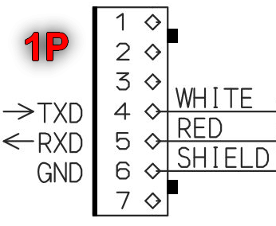
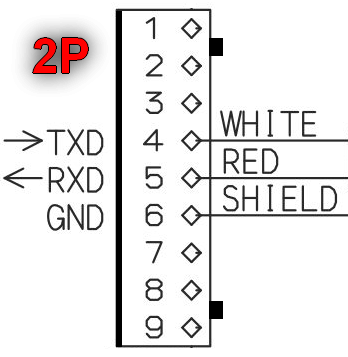
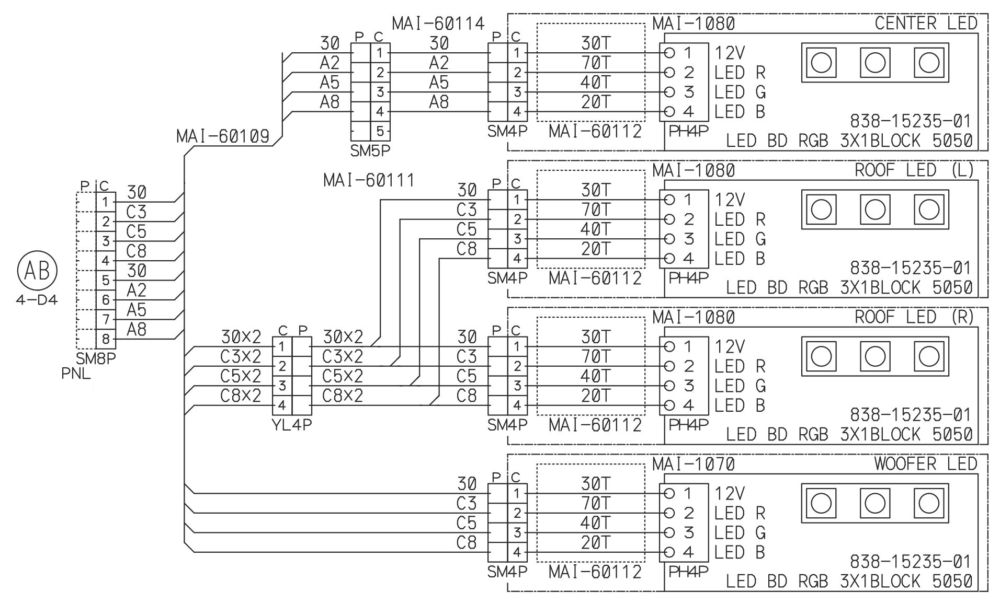
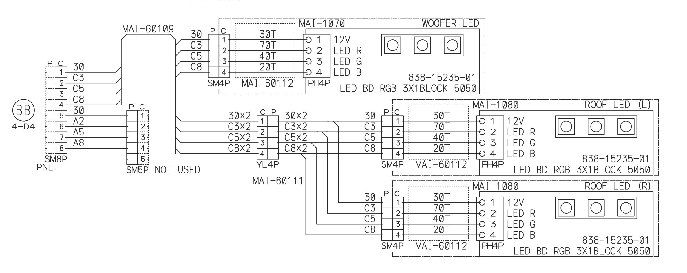
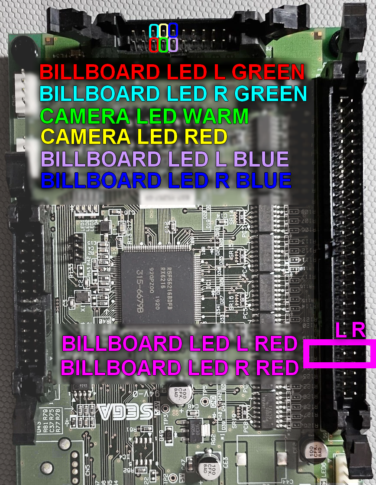
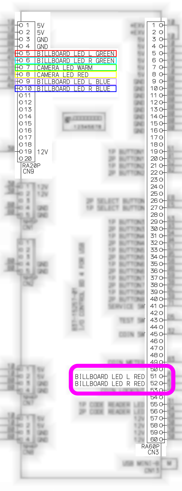

# 💡 Étape 6 : Lumières

L'éclairage est techniquement une étape *optionnelle* de la conversion, dans le sens où elle n'impacte pas la jouabilité de la borne. Toutefois, l'opération n'est pas si complexe et l'éclairage apporte beaucoup au charme de maimai DX. Il est donc recommandé de ne pas ignorer cette étape.

## Explications techniques

??? note "Cliquez ici pour l'explication technique"
    ### Fonctionnement des LEDs sur une maimai DX

    Sur une véritable borne *DX*, l'éclairage est piloté par trois contrôleurs différents :

    * L'**IO4** gère l'éclairage de l'**enseigne lumineuse** (désignée `BILLBOARD LED` / `ROOF LED` sur les schémas Sega). Voir l'[Étape 3](step-3-io-board.md).
    * Deux cartes de contrôle identiques (réf. `837-15070-04`) :
        * Côté P1 : Les huit boutons, l'éclairage du fond et l'éclairage du côté gauche.
        * Côté P2 : Les huit boutons, l'éclairage du fond et l'éclairage du côté droit.

    

    Les deux cartes de contrôle s'interfacent en RS-232 à un unique adaptateur RS-232 vers USB. Celui-ci est lui-même raccordé au même hub USB que les lecteurs de QR-Code (voir [Étape 7](step-7-cameras.md)).

    !!! info "Configuration logicielle des ports COM"
        Les contrôleurs de LEDs sont interfacés sur les ports COM virtuels du ALLS de la façon suivante :

        * **COM21** pour les LEDs du P1.
        * **COM23** pour les LEDs du P2.

    ### Fonctionnement des LEDs sur une maimai FiNALE

    Le fonctionnement est un peu plus simple sur FiNALE :

    * Contrairement à DX, aucune LED ne passe par l'IO3 de FiNALE.
    * Deux cartes de contrôle identiques gèrent les LEDs (réf. `837-15070-02-91`) :
        * Côté P1 : Les huit boutons, l'éclairage du fond, l'éclairage des woofers et l'enseigne lumineuse côté P1 et au centre.
        * Côté P2 : Les huit boutons, l'éclairage du fond, l'éclairage des woofers et l'enseigne lumineuse côté P2.

    

    Comme sur DX, ces deux cartes de contrôle s'interfacent en RS-232 au même adaptateur RS-232 vers USB. Par chance, **c'est exactement le même sur FiNALE et sur DX (réf. `837-15067-02`)**.

    Sur FiNALE, par contre, cet adaptateur se branche directement sur un port USB du RingEdge 2, sans passer par un hub USB.

    ### Ce que ça implique pour une conversion

    Trois observations :

    * Nous aurons besoin d'un hub USB 4 ports pour reproduire l'architecture de branchement sur le ALLS. maimai DX est très exigeant sur le port sur lequel les appareils USB sont connectés sur le ALLS.
    * L'éclairage de l'enseigne lumineuse n'est plus connecté aux contrôleurs de LEDs sur DX, ceux-ci ne reçoivent donc plus l'information pour l'éclairer. Il faudra recâbler ce connecteur vers l'IO4.
    * Mais surtout, **le point le plus important** : les contrôleurs de LEDs de FiNALE et de DX **n'ont pas la même référence**. Si vous tentez de brancher un contrôleur de LEDs FiNALE sur un ALLS faisant tourner DX, **le jeu se mettra en erreur non-bloquante au démarrage** car la référence envoyée par le contrôleur, `837-15070-02-91`, n'est pas celle que le jeu s'attend à recevoir, `837-15070-04`. Fait amusant : dans cet état, le jeu enverra tout de même les informations pour l'éclairage des boutons de jeu, mais pas pour le fond.

    Heureusement, il y a une solution pour ces trois problèmes.

## Pour les boutons de jeu et le fond des deux joueurs

Le problème est que pour les contrôleurs de LEDs, **maimai DX s'attend à recevoir l'identifiant `837-15070-04`**, mais ceux de FiNALE vont lui renvoyer `837-15070-02-91` et le jeu se mettra en erreur. C'est véritablement le seul problème : le contrôleur de FiNALE est autrement 100 % compatible avec les instructions envoyées par DX.

Nous devons donc trouver un moyen de modifier l'identifiant envoyé par les deux contrôleurs de LEDs pour qu'ils renvoient la valeur que le jeu s'attend à recevoir. C'est assez simple à faire de façon logicielle, mais nous souhaitons une fidélité logicielle parfaite. **Nous devons donc trouver une solution hardware.**

**La solution :** Un simple Raspberry Pi Pico, programmé avec un firmware maison, qui va venir s'installer entre le contrôleur de LEDs et son adaptateur RS-232 vers USB pour modifier uniquement le message où celui-ci envoie son identifiant. Tous les autres messages seront transférés à l'identique dans un sens comme dans l'autre.

Le logiciel est déjà tout prêt, il s'agit de [mailight_pico](https://gitea.farewell.dev/Yttris/mailight_pico), un port de *mailight_rs* par 4ndr3w sur GitHub. Il nous reste à fabriquer le proxy.

### Fabriquer un proxy

!!! info "En double exemplaire"
    Il vous faudra deux proxys, un pour chaque contrôleur de LEDs. Réalisez donc cette opération en deux exemplaires.

Commencez par installer le firmware mailight_pico sur le Raspberry Pi Pico. Si vous n'avez jamais installé de firmware sur un Pico, c'est extrêmement simple. [Toutes les instructions sont sur la page du projet](https://gitea.farewell.dev/Yttris/mailight_pico#3-installing-the-firmware).

Pour réaliser le proxy, vous avez deux options :

??? example "Sans soudure, plus facile, plus cher"
    Commencez par assembler votre Raspberry Pi Pico avec le `Pico-2CH-RS232`. Attention au sens, les inscriptions sur le dessous du `Pico-2CH-RS232` indique l'orientation dans laquelle le port USB du Pico est censé se trouver.

    !!! lightbox
        ](../resources/images/step-6-lighting/pico-2ch-rs232.png)

    !!! warning "Attention au sens"
        Assurez-vous que votre montage corresponde bien à l'image. Si votre Raspberry Pi Pico a, par exemple, son port USB entre les deux PCB plutôt qu'à l'extérieur comme sur l'image, cela veut dire que les broches de votre Pico sont soudées dans le mauvais sens. **N'essayez pas de l'allumer !** Vous ne parviendriez qu'à endommager le `Pico-2CH-RS232`. Vous devez soit ressouder les broches dans le bon sens vous-même, soit vous procurer un nouveau Pico correctement assemblé.

    Une fois votre matériel assemblé, il vous reste à préparer la connectique pour pouvoir insérer le Pico entre le contrôleur de LEDs et son adaptateur RS-232 vers USB. En fonction de si vous réalisez un proxy pour le contrôleur de LEDs du côté P1 ou P2, vous aurez besoin d'un connecteur différent :

    * Côté P1 : JST-XH **7** broches - Mâle **et** femelle
    * Côté P2 : JST-XH **9** broches - Mâle **et** femelle

    !!! lightbox
        
        

    Par simplicité, veillez à utiliser du fil blanc et rouge et installez-les aux positions correspondantes à l'installation de la borne. Sertissez le fil blanc sur la broche 4, le fil rouge sur la broche 5.
    Créez votre câble de telle sorte que si vous enfichez le connecteur mâle dans le connecteur femelle, les couleurs de fils soient alignées. Ces images proviennent du schéma de câblage, mais comme vous le constaterez, il n'y a pas de fil `SHIELD` sur les véritables connecteurs dans la borne, ce qui veut dire que nous devrons raccorder notre masse commune ailleurs sur le `Pico-2CH-RS232`.

    !!! lightbox
        

    Vous devez brancher les cables avec le connecteur **JST-XH mâle sur le bornier à vis Channel0**, et les cables avec le connecteur **JST-XH femelle sur le bornier à vis Channel1**. Ainsi, le Channel0 devrait se retrouver du côté de l'adaptateur RS-232 vers USB, et le Channel1 du côté du contrôleur de LEDs. Connectez les fils de la façon suivante :

    * Côté Channel0
        * TX0: Rouge
        * RX0: Blanc
        * GND: Raccordez un fil noir à cette borne et venez attacher son extrémité dénudée sur la borne GND de l'alimentation installée à [l'étape 1](step-1-alls-and-psu.md).
    * Côté Channel1
        * TX1: Blanc
        * RX1: Rouge

    Votre proxy est désormais terminé. Pour l'alimenter, le plus simple est de connecter un cable micro-USB au port du Pico, et d'en couper l'autre extrémité afin de directement raccorder le fil rouge de celui-ci sur la borne 5V et le fil noir sur la borne GND de l'alimentation installée à [l'étape 1](step-1-alls-and-psu.md).

??? example "Avec soudure, moins coûteux"
    !!! note "Matériel"
        La [liste de courses](equipment.md) part du principe que vous choisissez l'option simple. Si vous décidez de prendre cette option-ci à la place, vous pouvez ignorer les deux `Pico-2CH-RS232` et plutôt vous procurer ***[à définir]***.

    --8<-- "includes/wip-fr.md"

### Installer le proxy

Maintenant que vous avez vos deux proxys, il ne reste plus qu'à les installer. Vous pouvez débrancher le connecteur du contrôleur de LEDs et venir le raccorder sur le connecteur femelle de votre proxy ; le connecteur mâle du proxy, lui, vient prendre sa place sur l'adaptateur RS-232 vers USB.

Une fois le proxy installé pour les deux contrôleurs de LEDs, il ne vous reste plus qu'à connecter l'adaptateur RS-232 vers USB sur le ALLS via le hub USB, et le tour est joué. Le jeu devrait nativement reconnaître les contrôleurs de LEDs sans aucune modification logicielle.

!!! warning "Branchez l'adaptateur correctement"
    Comme mentionné à [l'étape 1](step-1-alls-and-psu.md), le hub USB doit impérativement être branché sur le port USB portant le numéro 2, et l'`adaptateur RS-232 vers USB` sur lequel les contrôleurs de LEDs sont connectés doit être branché sur le hub USB. Comme dit précédemment, maimai DX est très exigeant sur le port USB sur lequel les appareils sont connectés ; en cas de mauvais branchement, les LEDs ne s'allumeront pas.

    Même si vous ne comptez pas utiliser les caméras de QR-Code, le hub USB reste obligatoire.

## Pour l'enseigne lumineuse et les woofers

??? note "Cliquez ici pour l'explication technique"
    Sur une maimai FiNALE, les woofers et l'enseigne lumineuse sont sur le même circuit d'éclairage. Les deux éléments ne sont pas dissociés électriquement, l'un allume toujours nécessairement l'autre. Ainsi, bien que sur maimai DX les woofers ne soient plus illuminés, cela ne posera pas de problème puisque l'enseigne, elle, l'est toujours. Par contre, comme expliqué plus tôt, sur DX ce n'est plus le contrôleur de LEDs qui gère la lumière de cette section de la borne.

    Puisque le contrôleur de LEDs de DX ne gère plus l'allumage de l'enseigne lumineuse, le jeu ne lui envoie tout simplement pas l'information. Sur DX, **c'est l'IO4 qui s'occupe de gérer ces LEDs**. La raison de ce changement reste mystérieuse, mais cela implique de devoir recâbler une partie des branchements des contrôleurs de LEDs.

    Par chance, les ingénieurs de Sega ont bien fait les choses, et le schéma de câblage de FiNALE référence un connecteur très pratique qui va nous permettre de diffuser notre signal côté joueur 1 et joueur 2 sans avoir à recâbler l'ensemble de la borne :

    !!! lightbox
        
        

    Sur le schéma du P1, on constate un élément `CENTER LED` qui n'apparaît pas sur celui du P2. Il s'agit de l'éclairage du centre de l'enseigne lumineuse. Sur DX, cette distinction n'existe pas, et bien que les signaux soient séparés, l'enseigne est toujours éclairée de la même couleur des deux côtés. La solution la plus simple consiste donc à venir raccorder les broches `A2`, `A5` et `A8` du connecteur du P1 sur les broches `C3`, `C5` et `C8` afin que le centre soit éclairé de la même couleur que le côté joueur 1.

Nous devons simplement créer notre propre nappe de câbles s'intégrant avec l'IO4 via un connecteur JST-RA 20 broches pour le CN9, et se terminant sur deux connecteurs JST-SM 8 broches pour les côtés gauche et droit. Si vous avez suivi les suggestions de recâblage à l'[étape 3](step-3-io-board.md), vous devriez déjà avoir un connecteur JST-SM 2 broches de câblé sur le connecteur CN3 de l'IO4 pour les signaux `BILLBOARD LED L RED` et `BILLBOARD LED R RED`.

!!! lightbox
    
    

Réalisons alors notre propre nappe de câbles sur la base du schéma suivant. Idéalement, celui-ci doit avoir une longueur suffisante pour être installé proprement dans la borne : 3 mètres pour le côté joueur 1, 2 mètres pour le côté joueur 2. Pour le 12V, n'utilisez pas la broche 12V du CN9, mais préférez vous raccorder directement sur l'alimentation 12V interne de la borne. Vous éviterez ainsi de charger inutilement la carte I/O.

Une fois la nappe réalisée, vous n'avez plus qu'à la brancher à l'IO4, raccorder le 12V à l'alimentation interne, et venir raccorder les deux connecteurs JST-SM 8 broches d'origine sur votre nouveau câble. Assurez-vous de tester la continuité sur tous vos câbles avant l'installation afin d'écarter tout problème de broche mal sertie.

!!! tip "Les LEDs de la caméra"
    Si vous souhaitez connecter une caméra pour les joueurs, sertissez dès maintenant un connecteur JST-SM 2 broches sur les broches 7 et 8 du CN9, vous pourrez ainsi simplement venir raccorder les câbles des LEDs de la caméra sur celui-ci lorsque vous arriverez à cette étape.

## En résumé
!!! tldr "Les grandes lignes"
    Pour les LEDs des boutons et le fond de la borne :

    * Fabriquer deux proxys à base d'un Raspberry Pi Pico et d'un `Pico-2CH-RS232` chacun.
    * Installer le proxy entre le contrôleur de LEDs et l'adaptateur RS-232 vers USB.
    * Brancher l'adaptateur sur le hub USB sur le port approprié, et connecter le hub sur le port dédié du ALLS.

    Pour l'enseigne lumineuse et les woofers :

    * Confectionner et installer une nouvelle nappe de câbles partant de l'IO4 et venant se brancher sur les connecteurs existants de la borne.

---

Dernière étape (optionnelle) : les [Caméras](step-7-cameras.md).
