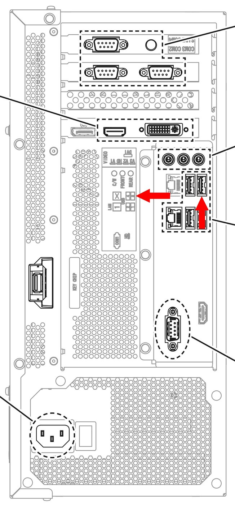
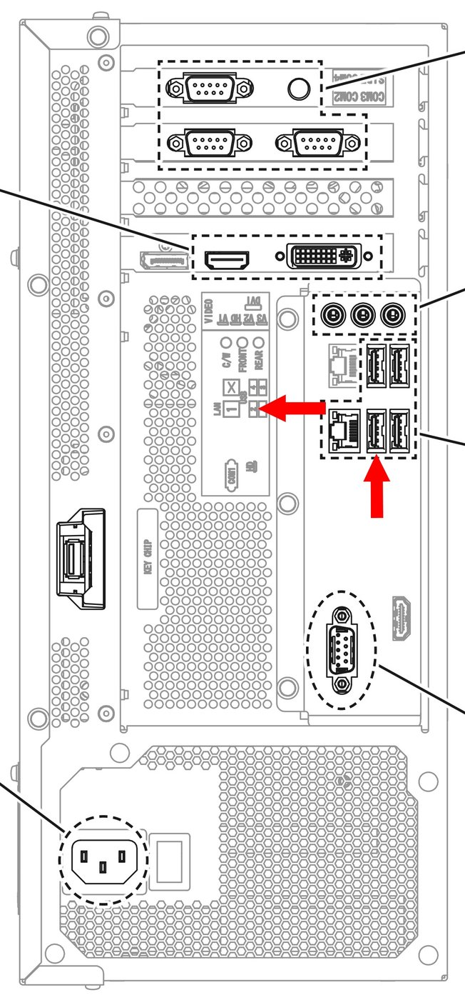
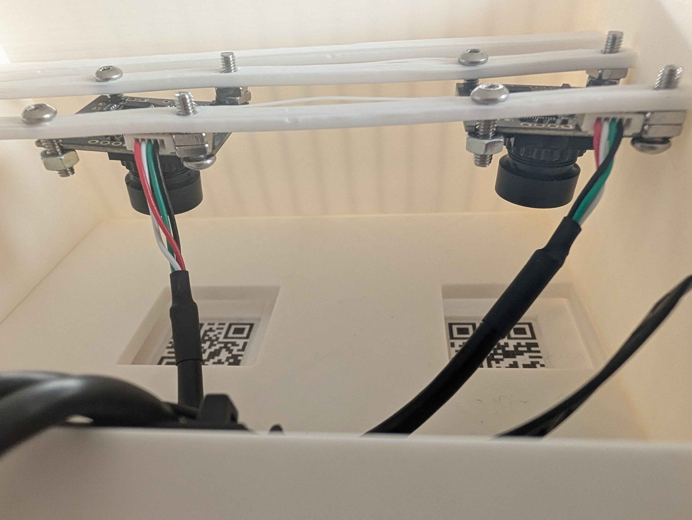

# 📷 Étape 7 : Caméras (Optionnel)

À ce stade, il ne reste qu'une fonctionnalité qui différencie notre conversion d'une véritable *DX* : les caméras. Le jeu en fait un usage très modéré, et elles sont largement considérées comme optionnelles. Si vous souhaitez vous rapprocher au maximum du fonctionnement d'une véritable *DX*, elles sont heureusement plutôt simples à installer.

## Explications techniques

??? note "Cliquez ici pour l'explication technique"
    Il y a un total de 3 caméras dans une véritable *DX*, une est pointée vers les joueurs et deux servent de lecteur de QR-Code pour les *DX Pass*.

    - La caméra des joueurs : Une simple caméra USB UVC d'une résolution de 1280x960 avec un HFOV de 95°. [[référence]](https://www.shikino.co.jp/eng/products/product-kbcr-s03mu.php)
    - Les caméras pour les lecteurs de QR-code : Deux caméras USB UVC, filmant en résolution 640x480 avec un FOV de 50°. 

    !!! info "Les DX Pass"
        Les DX pass sont des cartes physiques, que les joueurs peuvent faire imprimer via la borne "Sega CardMaker". Il est assez rare de trouver cette borne hors-Japon, et encore plus fonctionnelle (entendez capable d'imprimer). Qui plus est, aujourd'hui les DX Pass sont automatiquement associés numériquement au compte de l'utilisateur, la carte physique n'est plus nécessaire dans la borne. De ce fait, la présence de ces caméras pour les lecteurs de QR-Code est largement optionnelle, voire inutile. 
        
        Certains événements en jeu ne se déclenchent qu'en scannant des cartes spécifiques via les lecteurs de QR-codes, mais la plupart des serveurs privés débloquent ces événements par défaut.

    Pour la caméra des joueurs, n'importe quelle caméra USB UVC fera l'affaire. Le jeu s'en sert uniquement pour afficher une photo des joueurs à la fin de chaque musique. La plupart des joueurs désactivent cette option par gain de temps. Une webcam bon marché est suffisante.

    Pour les caméras des lecteurs de QR-code, le jeu est nettement plus exigeant. Il faut obligatoirement des caméras USB UVC capables de filmer en résolution 640x480. Le FOV est également précis, sans quoi les QR-codes ne sont pas reconnus par le jeu.

    Dans les deux cas le jeu s'attend à avoir un éclairage dédié pour chacune des caméras, ces LEDs sont contrôlées par l'IO4. Bien qu'il ne soit pas indispensable de les raccorder, les lecteurs de QR-code par exemple risquent de très mal fonctionner s'ils ne sont pas éclairés de façon appropriée. En ce qui concerne la caméra des joueurs, si votre borne se situe dans une salle d'arcade sombre l'éclairage sera nécessaire. Le jeu envoie également un signal pour une unique LED rouge, destinée à prévenir les utilisateurs que la caméra des joueurs filme.

    Les caméras se raccordent au ALLS via USB. La caméra des joueurs se branche directement sur la carte mère, tandis que les deux caméras des lecteurs de QR-Code se branchent sur le même hub USB qui accueille l'adaptateur RS-232 vers USB des contrôleurs de LEDs de [l'étape 6](step-6-lighting.md).

## Caméra des joueurs (Photos in-game)

En fonction du modèle de caméra que vous aurez choisi, il est difficile de concevoir un support universel. Votre meilleure option sera de concevoir un support imprimable en 3D que vous pourrez venir installer au sommet de la borne, en profitant des vis existantes pour la vitre en acrylique.

* **Installation sur la borne :** Impression 3D.
* **Branchement au ALLS :** En USB, sur le port **n°3**. (Voir [l'étape 1](step-1-alls-and-psu.md))
* **Branchement à l'IO4 :** 
    - **CAMERA LED WARM : CN9 - Broche 7** Cathode de l'anneau de LEDs blanches servant à éclairer la zone filmée par la caméra.
    - **CAMERA LED RED : CN9 - Broche 8** Cathode de l'unique LED rouge servant à indiquer aux joueurs que la caméra filme.

Si vous avez confectionné votre propre nappe de câbles et suivi la suggestion à [l'étape 6](step-6-lighting.md), vous devriez déjà avoir un connecteur à disposition pour le branchement sur l'IO4. Alternativement, si vous avez opté pour la PCB de conversion alors deux connecteurs dédiés sont à disposition pour ces LEDs.

!!! lightbox
    
     : repérage des connecteurs J29 (`CAMERA LED RED`) et J30 (`CAMERA LED WARM`)](../resources/images/step-7-cameras/camera-led-on-convertion-pcb.jpg)

## Caméras des lecteurs de QR-Code

Pour les lecteurs de QR-Codes, l'idéal est de se procurer deux petits modules de 30mm par 25mm, ceci vous permettra d'utiliser [le modèle 3D conçu par SpiralGlide](spiralglide-resources.md#support-du-lecteur-de-qr-code-dx-pass-reader) qui s'installe sur la borne grâce aux vis existantes pour la vitre en acrylique.

* **Installation sur la borne :** [Impression 3D](spiralglide-resources.md#support-du-lecteur-de-qr-code-dx-pass-reader).
* **Branchement au ALLS :** En USB, via un hub USB branché sur le port **n°2**. N'importe quel port USB du hub convient. (Voir [l'étape 1](step-1-alls-and-psu.md))
* **Branchement à l'IO4 :** 
    - **1P CODE READER LED : CN3 - Broche 55** Cathode commune des signaux R, G, et B de la bande de LEDs éclairant la caméra du lecteur du joueur 1.
    - **2P CODE READER LED : CN3 - Broche 56** Cathode commune des signaux R, G, et B de la bande de LEDs éclairant la caméra du lecteur du joueur 2.

Pour que le jeu parvienne à identifier les caméras des QR-Codes, celles-ci doivent pointer sur un QR-Code lisant *SDEZ01* côté joueur 1, et *SDEZ02* côté joueur 2. Le modèle 3D de SpiralGlide contient une encoche à la bonne taille pour ces deux codes. Vous pouvez imprimer [ce PDF](../resources/images/step-7-cameras/codes-for-qr-code-readers.pdf) en A4 sur une imprimante correctement calibrée pour obtenir les QR-Codes à la bonne taille pour les coller à l'emplacement approprié.

Si vous avez choisi les caméras proposées dans la [liste de courses](equipment.md), sachez qu'il est possible d'ajuster la lentille de celles-ci pour régler la mise au point de l'image.

!!! tip "Les LEDs des lecteurs de QR-Code"
    De base, *DX* utilise une bande de LEDs RGB pour éclairer la zone, mais les trois signaux R, G, et B ont une unique cathode en commun, pilotée par l'IO4. Dans les faits, cela signifie que les trois couleurs s'allument en même temps à (presque) la même intensité. Fonctionnellement, vous pouvez y substituer une bande de LEDs d'un blanc chaud, le résultat sera le même.
    
    Pour l'installation de la bande de LEDs, ne braquez pas les LEDs directement sur la lentille de la caméra. Éclairez plutôt la paroi en plastique pour que la lumière rebondisse de façon diffuse sur la carte. Sinon l'illumination frontale provoquera un reflet qui éblouira la caméra et empêchera le jeu de lire le QR-Code.

!!! tip "Installation des modules de caméra"
    Le jeu est assez exigeant sur l'orientation du module de caméra, si l'angle n'est pas parfaitement identique à ce qu'il s'attend à recevoir il ne parviendra pas à lire le QR-Code de la carte. Méfiez-vous également, ce n'est pas parce que le QR-Code par défaut est bien lisible que les cartes le seront également, faites des essais. Bien que ce ne soit pas idéal, vous pouvez par exemple ajuster la hauteur et l'angle du module en rajoutant des écrous sur la vis pour modifier son inclinaison.

    Vous pouvez tester la détection des caméras dans le menu Test du jeu. Il n'y a malheureusement pas de meilleure méthode que l'essai-erreur pour cette étape.

!!! lightbox
    
     : repérage des connecteurs J25 (`1P CODE READER LED`) et J26 (`2P CODE READER LED`)](../resources/images/step-7-cameras/code-reader-led-on-convertion-pcb.jpg)
    

## Validation de l'installation

Dans le menu Test du jeu, vous avez accès à une page dédiée au contrôle des caméras. Le jeu s'attend à trouver un total de trois flux vidéo provenant des caméras que vous venez d'installer, et parmi ces trois flux il en cherche deux qui pointent vers les QR-Codes par défaut [SDEZ01](../resources/images/step-7-cameras/SDEZ01.svg) et [SDEZ02](../resources/images/step-7-cameras/SDEZ02.svg). Les caméras des QR-Codes seront automatiquement reconnues grâce à ceux-ci, et le jeu assigne la caméra restante à la caméra des joueurs.

Si les trois caméras sont bien reconnues dans le bon ordre dans le menu, félicitations, l'installation est terminée.

---

Vous avez terminé toutes les étapes ? Direction la [conclusion](conclusion.md) !
