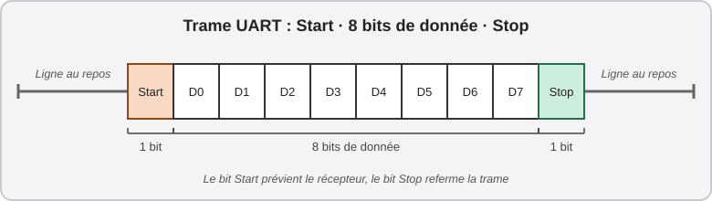
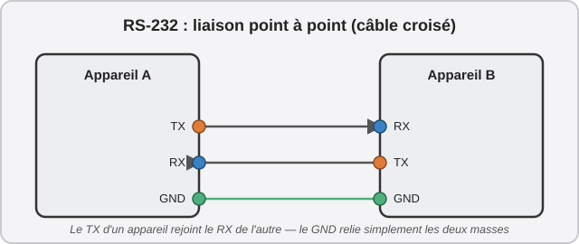
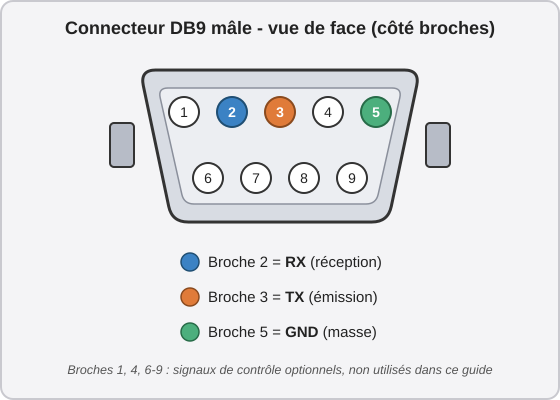
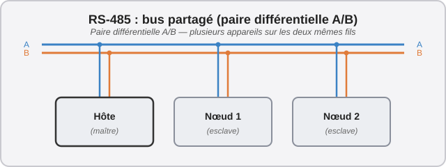
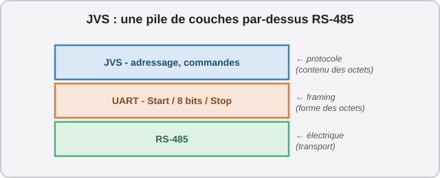
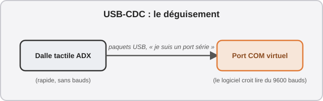

# 🎓 Petit cours : comprendre les protocoles "série"

Ce guide mentionne plusieurs protocoles de communication : **UART**, **RS-232**, **RS-485**, **JVS** et **USB-CDC**. Si vous découvrez ces technologies, cette annexe vous propose un petit cours pour comprendre à quoi ils servent, ce qui les différencie, et comment deux appareils parviennent à "se comprendre".

## 1. La base commune : parler "en série"

Un port "série" envoie les données un bit à la fois, à la queue leu-leu, sur un seul fil (par opposition à un port "parallèle", qui utilise plusieurs fils en même temps). Chaque paquet d'information ("un octet") est enveloppé dans une petite trame, un peu comme une lettre dans une enveloppe :

{ width="720" }

Le bit *Start* prévient le récepteur qu'une lettre arrive, les 8 bits suivants sont le contenu, et le bit *Stop* referme l'enveloppe (il existe des variantes avec plus ou moins de bits, mais "8 bits de donnée + 1 bit Stop" est de très loin la plus courante). Ce découpage porte un nom : c'est une trame **UART** (*Universal Asynchronous Receiver-Transmitter*), du nom de la puce qui la fabrique — UART désigne donc à l'origine un composant électronique, mais par extension on l'utilise aussi pour désigner ce découpage lui-même. Il vit au niveau d'une puce électronique (un microcontrôleur, par exemple), avec de petites tensions "logiques" (souvent appelées *TTL* pour *Transistor-to-Transistor Logic* — 0V pour un "0", 3,3V ou 5V pour un "1"). RS-232 et RS-485, présentés juste après, ne sont que deux façons différentes de traduire *électriquement* ce même découpage en bits pour l'envoyer sur un câble plus long ou plus fiable — comme une même lettre que l'on peut confier à deux services postaux différents, sans changer ce qui est écrit dessus.

**Le rôle de "l'horloge" :** pour lire correctement une suite de bits, il faut savoir à quel instant précis regarder la ligne — un peu comme un métronome qui bat la mesure pour des musiciens. En électronique, ce signal de cadencement s'appelle une **horloge** (*clock* en anglais) : rien à voir avec une pendule qui donne l'heure, c'est simplement un signal qui répète "maintenant, maintenant, maintenant..." à intervalle fixe, pour dire à chaque appareil "lis le bit suivant". C'est justement ce que veut dire le "A" de UART, pour *Asynchronous* : il n'y a **pas** de fil dédié à ce signal d'horloge. Chaque appareil doit deviner le bon rythme tout seul, grâce à sa propre horloge interne, réglée à l'avance sur le débit convenu.

**Comment la communication s'établit :** les deux appareils doivent donc être d'accord, à l'avance, sur cette vitesse de lecture : c'est le fameux **débit en bauds** (ex. "9600 bauds" = 9 600 bits par seconde). Aucune négociation n'a lieu sur le fil : si les deux bouts ne sont pas réglés sur la même vitesse, chacun lit le mauvais bit au mauvais moment. C'est une convention fixée d'avance, pas une poignée de main.

## 2. RS-232 : le point à point

RS-232 traduit ce même découpage en bits UART en des tensions plus élevées *et inversées* (typiquement entre -15V et +15V, souvent ±5 à ±12V en pratique — un "1" logique devient une tension négative, un "0" une tension positive), pour supporter des câbles plus longs que les faibles 3,3V/5V d'un UART brut. Elle ne relie que **deux appareils**, chacun avec son propre fil d'émission :

{ width="500" }

Le "TX" (émission) d'un côté se branche sur le "RX" (réception) de l'autre — c'est ce croisement que fait un [adaptateur Null Modem](glossary.md#communication-et-protocoles). RS-232 ne se limite d'ailleurs pas à ces tensions : elle normalise aussi le connecteur (le fameux port "DB9") et quelques fils de contrôle supplémentaires, ce qui rend justement ce genre de câble croisé possible.

Dans ce guide, RS-232 est le protocole que le jeu utilise pour piloter les [contrôleurs de LEDs](step-6-lighting.md) et pour dialoguer avec les dalles tactiles *d'origine*, ainsi que pour récupérer l'information du lecteur Aime et dire quoi afficher au VFD. C'est un standard très utilisé dans le milieu de l'arcade.

**Le connecteur DB9 :** c'est le petit connecteur trapézoïdal à 9 broches sur deux rangées que RS-232 a rendu quasi universel. On le confond souvent à tort avec un port VGA "inversé". C'est celui que l'on retrouve sur le RingEdge 2 et sur le ALLS. Sur les 9 broches, seules trois nous intéressent vraiment ici : **TX** (émission), **RX** (réception) et **GND** (la masse, la référence commune de tension) — comme sur le schéma point à point vu plus haut. Les autres broches (DTR, DSR, RTS, CTS, DCD, RI) servent à des signaux de contrôle optionnels (négociation de flux, détection de porteuse...), rarement utilisés dans le domaine de l'arcade.

{ width="600" }

Un connecteur "femelle" présente les mêmes numéros de broches, mais en creux plutôt qu'en pointes, et miroir horizontalement. C'est pour cela qu'un câble croisé (Null Modem) doit explicitement inverser les broches 2 et 3 d'un bout à l'autre : brancher deux appareils "en direct" (broche 2 sur broche 2, broche 3 sur broche 3) connecterait deux TX ensemble et deux RX ensemble, ce qui ne fonctionne pas. La transmission (Tx) d'un appareil doit être liée à la Réception (Rx) de l'autre, et vice-versa.

## 3. RS-485 : le bus à plusieurs

RS-485 traduit lui aussi ce même découpage en bits UART, mais avec une astuce différente de RS-232 : au lieu d'un fil "haut/bas" (comprendre "chargé électriquement ou pas") comparé à la masse, il utilise une **paire différentielle**, à des tensions proches du TTL de départ (deux fils, A et B, dont on compare la différence de tension entre eux plutôt que par rapport à la masse). Cela le rend beaucoup plus résistant aux parasites sur de longs câbles, et surtout, il permet de brancher **plusieurs appareils sur la même paire de fils** :

{ width="720" }

Mais RS-485 ne dit rien de *qui* a le droit de parler à quel moment : sans règle, les appareils se marcheraient dessus et les signaux se mélangeraient. C'est cette capacité à chaîner plusieurs appareils sur les mêmes deux fils, combinée au protocole qui va se charger de cette règle, qui en fait le support idéal pour le JVS (voir point suivant).

## 4. JVS : un protocole construit par-dessus RS-485

Attention à ne pas confondre les niveaux : RS-485 ne définit que l'aspect *électrique* (comment les bits voyagent sur le fil). **JVS** est encore une couche au-dessus, qui définit un langage commun (adressage, commandes) pour que le jeu et la carte I/O se comprennent.

**Le lien avec l'UART du point 1 :** JVS ne réinvente pas la façon d'envoyer les bits. Il utilise exactement les mêmes trames UART (Start / 8 bits de données / Stop) vues plus haut, simplement transportées électriquement en RS-485 — la *nature* des paquets ne change pas. Ce que JVS ajoute, c'est une convention standardisée sur le *contenu* de ces octets UART : un paquet JVS commence toujours par un octet de synchronisation, puis un octet d'adresse (qui désigne le destinataire), une longueur, les données de la commande, et une somme de contrôle pour détecter les erreurs. Le jeu et la carte I/O échangent donc de simples octets UART, comme n'importe quel autre appareil série — c'est en interprétant leur contenu selon les règles JVS que les deux bouts savent de quoi il retourne :

{ width="720" }

**Comment la communication s'établit :** au démarrage, le jeu (l'hôte) commence par une commande de réinitialisation envoyée à tous les appareils du bus en même temps. Il demande ensuite, encore une fois à tous en même temps, "qui n'a pas encore d'adresse, réponds-moi" ; grâce à un fil supplémentaire câblé en chaîne d'un appareil au suivant, un seul appareil à la fois est autorisé à répondre, ce qui permet à l'hôte de leur attribuer une adresse un par un (l'auto-adressage JVS). Une fois les adresses distribuées, l'hôte interroge chaque carte à tour de rôle ("cette carte a-t-elle du nouveau ?") : c'est un dialogue **maître/esclaves**, où seul l'hôte prend l'initiative. C'est typiquement la carte I/O qui parle JVS dans un système d'arcade ; malgré son câble USB, elle communique en réalité toujours via une liaison série RS-485 sous le capot.

## 5. USB-CDC : le déguisement

L'USB est une toute autre famille de protocole : par paquets, bien plus rapide, et **négocié** — à la connexion, l'appareil se présente à l'ordinateur et décrit lui-même ses capacités ("l'énumération USB"). La classe **CDC** (*Communication Device Class*) est un cas particulier où l'appareil dit à l'ordinateur : *"traite-moi comme un port RS-232"*. L'ordinateur crée alors un port COM virtuel, mais le transport réel reste de l'USB par paquets :

{ width="720" }

C'est pratique pour la compatibilité logicielle : un programme qui ne sait parler qu'au RS-232 fonctionne sans modification. Mais attention, le déguisement ne *crée* pas de goulot d'étranglement : c'est plutôt le contraire qui pose problème. Le débit de "9600 bauds" affiché par le port COM virtuel n'est qu'une façade, le matériel USB derrière continue d'aller à pleine vitesse — c'est quand ces données rapides doivent ensuite être renvoyées vers un appareil qui, lui, est *réellement* limité à 9600 bauds (comme le jeu, plus loin sur la chaîne) que le goulot d'étranglement apparaît. C'est l'un des problèmes rencontrés avec les dalles tactiles ADX, une alternative mentionnée dans la [Liste de courses](equipment.md).

## Résumé express

| Protocole | Couche | Topologie | Établissement de la liaison |
|---|---|---|---|
| UART | Framing + logique (TTL, 3,3V ou 5V) | Point à point (avant tout support électrique) | Débit en bauds fixé à l'avance des deux côtés — la base commune à tout ce qui suit |
| RS-232 | Électrique + connecteur (traduit l'UART) | Point à point (2 appareils) | Idem UART, simplement porté en tensions plus élevées |
| RS-485 | Électrique (traduit l'UART) | Bus (plusieurs appareils) | Idem UART ; ne gère ni adresses ni tour de parole, ça vient du protocole du dessus (ex. JVS) |
| JVS | Protocole (au-dessus de l'UART, transporté en RS-485) | Chaîne maître/esclaves | L'hôte réinitialise le bus puis distribue les adresses un par un au démarrage |
| USB-CDC | Protocole (au-dessus de l'USB) | Point à point | Négocié à la connexion (USB), puis déguisé en port série |

---
