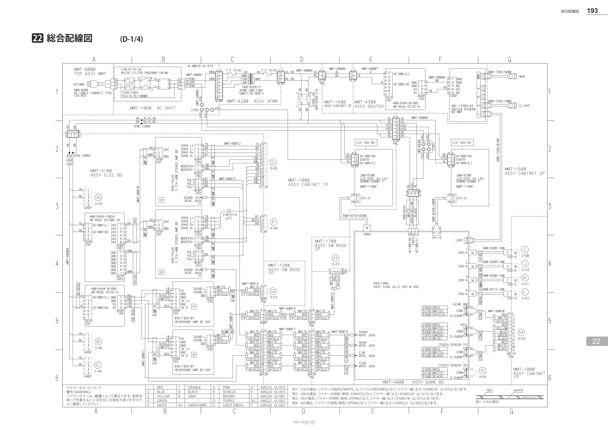
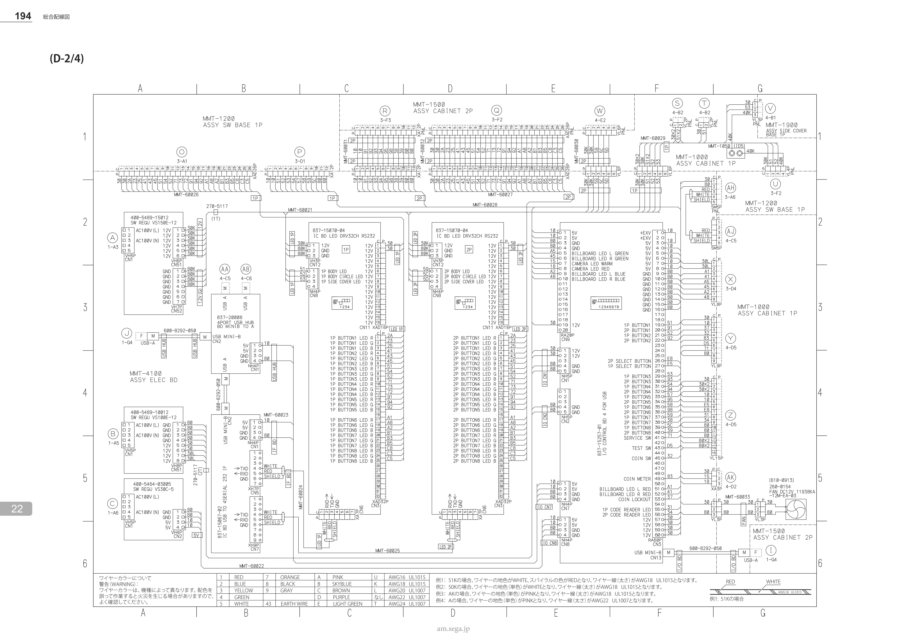
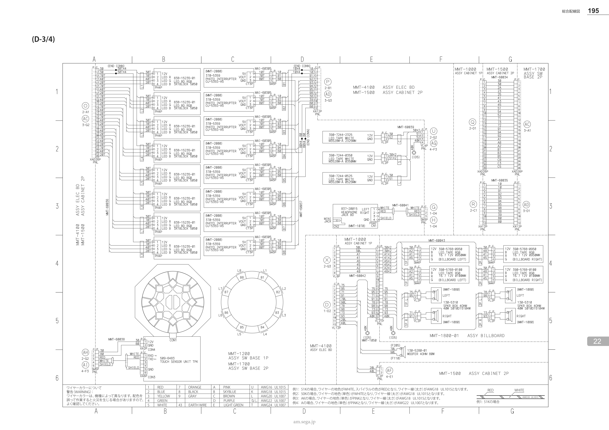
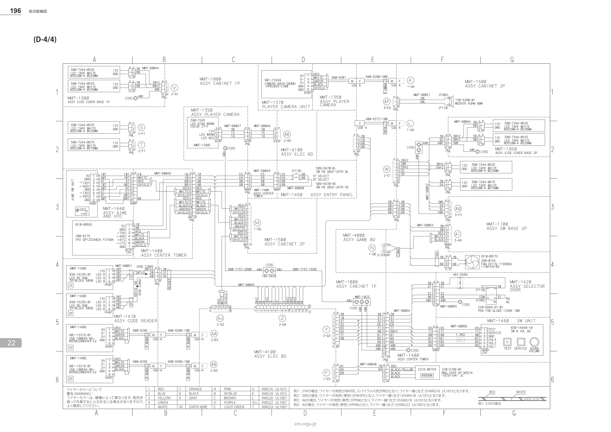
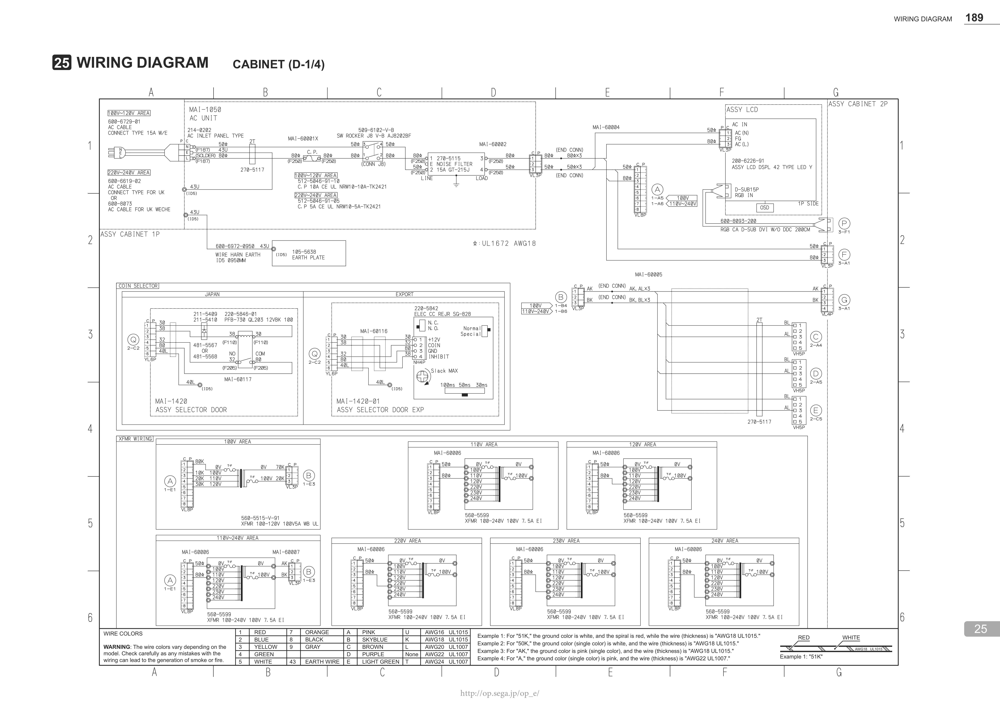
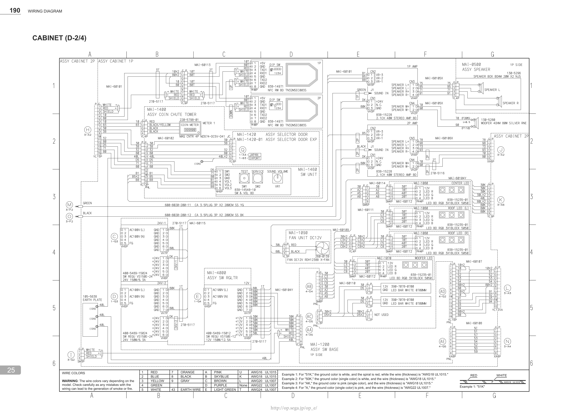
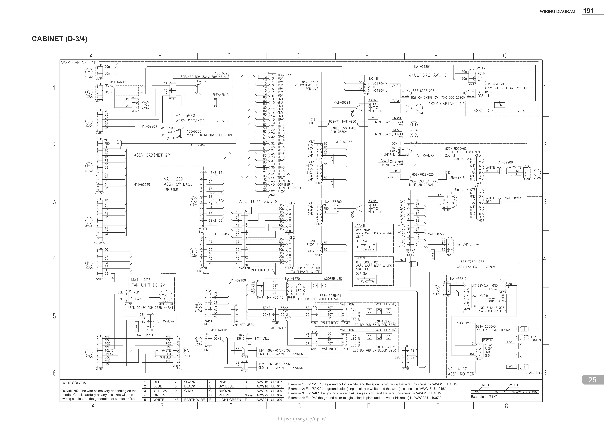
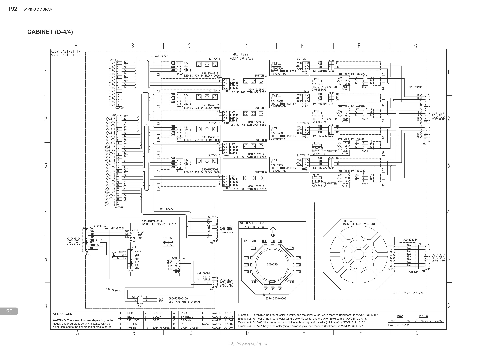
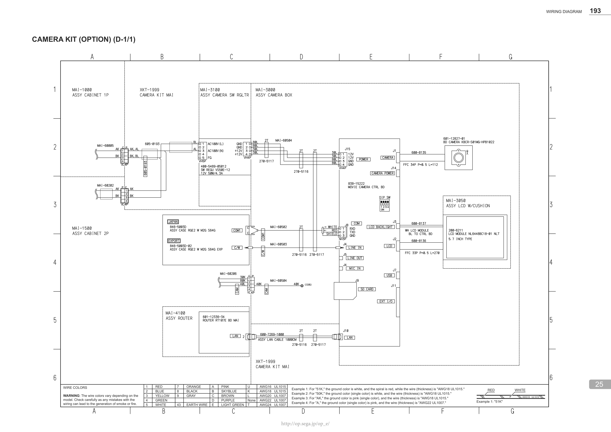

# Schémas de câblage

Les [manuels officiels](official-manuals.md) contiennent, dans leurs toutes dernières pages, le schéma de câblage complet de la borne (planches au format A3, une par manuel de plusieurs dizaines de Mo). Pour éviter d'avoir à télécharger l'intégralité d'un manuel et à zoomer dans un lecteur PDF juste pour retrouver un fil, voici ces planches extraites en haute résolution.

*(Cliquez sur une planche pour l'ouvrir en pleine résolution dans un nouvel onglet. Chaque planche est précédée de la liste des cartes/modules qui y apparaissent, avec leur numéro de pièce, pour pouvoir retrouver une carte avec `Ctrl+F`.)*

## Manuel maimai DX

Chapitre *22 総合配線図* (« schéma de câblage général »), pages 193 à 196 du [manuel maimai DX](../resources/pdfs/maimai-dx-manual-full.pdf).

**Planche 1/4 — Alimentation, PC *ALLS*, ampli et écrans joueurs :**

* `MMT-1050` **ASSY AC UNIT** — bloc d'entrée secteur (filtre antiparasite, fusible, prise IEC)
* `MMT-4200` **ASSY XFMR** — transformateur d'alimentation
* `MMT-4300` / `601-13203-63` **ASSY ROUTER (ROUTER RTX830 BD MMT)** — carte routeur réseau
* `MMT-4100` **ASSY ELEC BD** — carte électronique principale, qui regroupe :
    * `838-15228` **2.1CH 40W STEREO AMP BD** ×2 — amplis audio joueur 1 et 2
    * `839-1363-01` **HEADPHONE AMP BD SHC** ×2 — amplis casque joueur 1 et 2
    * `400-5489-15024` **SW REGU VS150E-24** — alimentation à découpage 24V
    * `400-5464-01505` **SW REGU VS15C-5** — alimentation à découpage 5V
* `849-1004` **ASSY CASE ALLS HX2 W HDD** — le boîtier du PC *ALLS* lui-même
* `MMT-1000` / `MMT-1500` **ASSY CABINET 1P / 2P** — écrans joueurs (`200-6280` **LCD DSPL 43 LED**)
* `MMT-1200` / `MMT-1700` **ASSY SW BASE 1P / 2P** — embases des boutons

**Planche 2/4 — Boutons, LEDs de boutons, hub USB et carte I/O :**

* `MMT-1200` / `MMT-1700` **ASSY SW BASE 1P / 2P** — embases des boutons
* `837-15070-04` **IC BD LED DRV32CH RS232** ×2 — pilote de LEDs, un par côté
* `837-20008` **4PORT USB HUB BD MINIB TO A** — hub USB 4 ports
* `837-15067-02` **IC BD USB TO 4SERIAL 232 IF** — convertisseur USB vers 4 ports série
* `837-15257-01` **I/O CONTROL BD 4 FOR USB** — la carte **IO4** (JVS), voir l'[étape 3](step-3-io-board.md)
* `MMT-1000` / `MMT-1500` / `MMT-1900` **ASSY CABINET 1P / 2P / SIDE COVER BASE 1P**

**Planche 3/4 — Boutons tactiles, capteur de l'anneau tactile, enseigne lumineuse :**

* `MMT-2000` **ASSY BUTTON SWITCH** ×8 — boutons, avec pour chacun :
    * `838-15235-01` **LED BD RGB 3X1BLOCK 5050** — LED RGB du bouton
    * `370-5359` **PHOTO INTERRUPTER OJ-555S-A5** — capteur optique d'appui du bouton
* `837-20015` **HEADPHONE JACK BD** (`MMT-1070`) — carte de la prise casque
* `509-6483` **TOUCH SENSOR UNIT TPK** — carte du capteur de l'anneau tactile
* `MMT-1800-01` **ASSY BILLBOARD** — enseigne lumineuse du haut de la borne
    * `390-5768` **LED TAPE RGB** — rubans LED RBG du haut de la borne
    * `MMT-1080` haut-parleurs `130-5310`
* `390-7244` **LED TAPE WHITE M3528W-A** — rubans LED blancs de l'anneau
* `130-5280-01` **WOOFER 4OHM 80W**

**Planche 4/4 — Caméras, lecteur Aime, monnayeur et panneau d'entrée :**

* `MMT-1350` / `MMT-1370` **ASSY PLAYER CAMERA / PLAYER CAMERA UNIT** — caméras joueurs
    * `601-13249` **CAMERA KBCR-S03MU-HPB2033-C300**, voir l'[étape 8](step-8-cameras.md)
* `MMT-1440` **ASSY AIME AND VFD** — module lecteur Aime (AIME RW UNIT) et afficheur 
    * `200-6275` **VFD GP1232A02A FUTABA**, voir l'[étape 4](step-4-aime-reader.md)
* `MMT-1470` **ASSY CODE READER** — lecteur de QR code
    * `601-13216-01` **USB CAMERA MS-M33NU2AMSH43-S2**
* `MMT-1400` **ASSY CENTER TOWER** — tour centrale
* `MMT-1450` **ASSY ENTRY PANEL** — boutons de sélection joueur
    * `509-5970` **SW PB OBSF-24TR** — référence Sanwa
* `MMT-1420` **ASSY SELECTOR DOOR** — sélecteur/monnayeur
    * `220-5846-91-01` — mécanisme accepteur de pièces
    * `220-5798-01` **MAG CNTR 4P MZ674** — compteur de pièces
* `MMT-1460` **SW UNIT** — boutons test/service
    * `838-14548-10` **SW & VOL BD**
* `MMT-1900` / `MMT-1950` **ASSY SIDE COVER BASE 1P / 2P**

## Manuel maimai PiNK

Chapitre *25 WIRING DIAGRAM*, pages 189 à 193 du [manuel maimai PiNK](../resources/pdfs/maimai-pink-manual-full.pdf).

**Planche 1/4 — Alimentation, écran et sélecteur de pièces :**

* `MAI-1050` **AC UNIT** — bloc d'entrée secteur
* **ASSY LCD** — Joueur 1, écran (`200-6226-91` **ASSY LCD DSPL 42 TYPE LED Y**)
* mécanisme accepteur de pièces
    * `MAI-1420` **ASSY SELECTOR DOOR** (version Japon, `220-5846-01` **PFB-730 QL203 12VBK 100**) 
    * `MAI-1420-01` **ASSY SELECTOR DOOR EXP** (version export, `220-5842` **ELEC CC REJR SG-828**)
* **XFMR WIRING** — transformateurs multi-tension (`560-5515-V-91`, `560-5599`)

**Planche 2/4 — Lecteur Aime, haut-parleurs, LEDs et alimentations :**

* `MAI-1400` **ASSY COIN CHUTE TOWER** — tour centrale
    * `838-14971` **NFC RW BD TN32MSEC003S** — la carte du lecteur de carte Aime, remplacée à l'[étape 4](step-4-aime-reader.md)
* `MAI-1420` **ASSY SELECTOR DOOR**
    * `220-5798-01` **MAG CNTR 4P MZ674** — compteur de pièces
* `MAI-1460` **SW UNIT** (`838-14548-10` **SW & VOL BD**) — boutons test/service et volume
* `MAI-0500` **ASSY SPEAKER** — haut-parleurs
    * `838-15228` **2.1CH 40W STEREO AMP BD** ×2
    * `130-5296` caisson 
    * `130-5280` woofer
* `MAI-1090` **FAN UNIT DC12V** (`260-0139`) — ventilateur
* `MAI-4000` **ASSY SW RGLTR** — alimentations à découpage (`400-5489-15024`/`15012`)
* `MAI-1080` **CENTER LED / ROOF LED (L) / ROOF LED (R)** ×3
    * `MAI-1070` **WOOFER LED** — LEDs décoratives (`838-15235-01` **LED BD RGB**)

**Planche 3/4 — Carte I/O (JVS), convertisseur Serial-USB, contrôleur tactile et PC *RingEdge2* :**

* **ASSY LCD** — Joueur 2, écran (`200-6226-91` **ASSY LCD DSPL 42 TYPE LED Y**)
* `837-14505` **I/O CONTROL BD FOR JVS** — la carte IO3, remplacée par l'IO4 à l'[étape 3](step-3-io-board.md)
* `837-15067-02` **IC BD USB TO 4SERIAL 232 IF** — le convertisseur Serial-USB mentionné à l'[étape 7](step-7-lighting.md)
* `838-15221` **SERIAL I/F BD TOUCHPANEL GUNZE** — carte contrôleur de la dalle tactile
* **ASSY CASE RGE2 W M2G S64G** — PC *RingEdge2* 
    * `846-5003D` (version Japon)
    * `846-5003D-02` (version export)
* `MAI-4100` **ASSY ROUTER** (`601-12336-34` **ROUTER RT107E BD MAI**)

**Planche 4/4 — Boutons, contrôleur de LEDs et anneau tactile :**

* `MAI-1200` / `MAI-1201` **ASSY SW BASE** — embase et disposition des 8 boutons
    * `838-15235-01` **LED BD RGB**
    * `370-5359` **PHOTO INTERRUPTER OJ-535S-A5**
* `837-15070-02-91` **IC BD LED DRV32CH RS232** — le contrôleur de LEDs mentionné à l'[étape 7](step-7-lighting.md)
* `509-6384` **TOUCH SENSOR PANEL UNIT** — carte du capteur de l'anneau tactile

**Kit caméra en option — Caméra joueur et boîtier de contrôle :**

* `MAI-3100` **ASSY CAMERA SW RGLTR** (`400-5489-05012` **SW REGU VS50E-12**) — PSU de la caméra
* `MAI-3000` **ASSY CAMERA BOX** — boîtier caméra, voir l'[étape 8](step-8-cameras.md)
    * `838-15222` **MOVIE CAMERA CTRL BD**
    * `601-12827-01` **BD CAMERA KBCR-S01MG-HPB1022**
* `MAI-3050` **ASSY LCD W/CUSHION** — écran de retour (`200-6211` **LCD MODULE NL6448BC18-01 NLT**)
* **ASSY CASE RGE2 W M2G S64G** — PC *RingEdge2* 
    * `846-5003D` (version Japon)
    * `846-5003D-02` (version export)
* `MAI-4100` **ASSY ROUTER** (`601-12336-34` **ROUTER RT107E BD MAI**)

